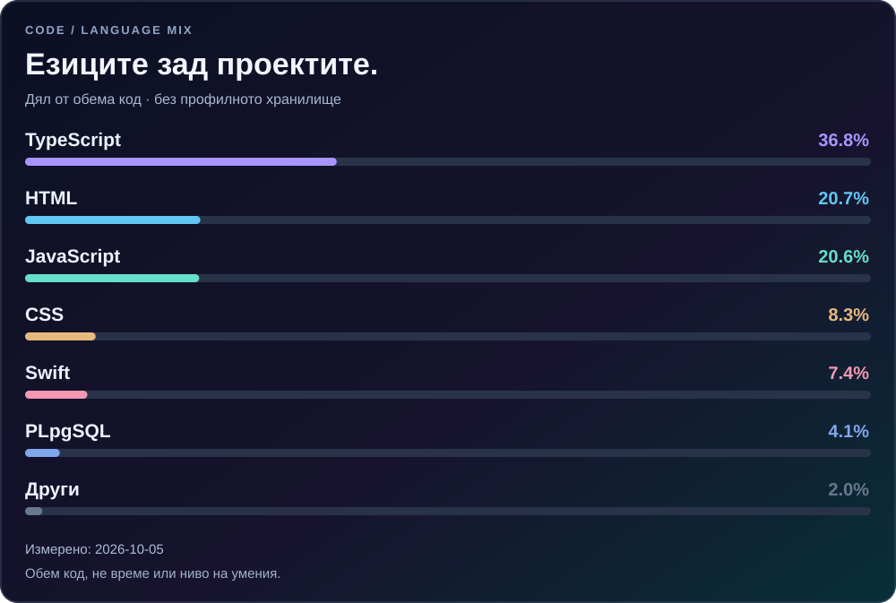

<picture>
<source media="(max-width: 600px)" srcset="assets/motion/hero-bg-mobile.svg" />

</picture>

<b><a href="#проекти">Проекти</a> · <a href="#услуги">Услуги</a> · <a href="#технологии">Технологии</a> · <a href="#сертификати">Сертификати</a> · <a href="#активност">Активност</a> · <a href="#процес">Процес</a> · <a href="#контакт">Контакт</a></b>

## 👋 Здравейте, аз съм Явор

Създавам дигитални продукти, които свързват дизайн, код и реални работни процеси. Работя по уеб приложения, индивидуален софтуер, Discord ботове, игри, FiveM системи, автоматизации и инструменти за разработчици.

**Приемам платени поръчки** — от конкретна функционалност или нов сайт до цялостна платформа. Помагам с уточняването на обхвата, разработката, интеграциите и подготовката за публикуване.

<picture>
<source media="(max-width: 600px)" srcset="assets/motion/divider-01-bg-mobile.svg" />

</picture>

## 🚀 Избрани проекти

<a href="#before-i-deploy"><picture>
<source media="(max-width: 600px)" srcset="assets/motion/bento-bg-mobile.svg" />

</picture></a>

Голяма част от изходния код е частен. Тук представям конкретната работа, техническите решения и начина си на работа.

<picture>
<source media="(max-width: 600px)" srcset="assets/motion/project-bid-bg-mobile.svg" />

</picture>

**Ясна подготовка за публикуване — от първата проверка до следващото действие.**

Нативно приложение за macOS за преглед на локални уеб проекти, разбиране на предупрежденията и подготовка на тестова или продукционна версия. **Моят принос:** разработих SwiftUI интерфейса, командния Node.js модул и връзките между проверките, хостинга и облачните услуги.

<picture>
<source media="(max-width: 600px)" srcset="assets/screens/framed/before-i-deploy.jpg" />

</picture>

- **Общ процес за проверки:** Git, тайни ключове, зависимости, статичен анализ, типове, компилация, качество на сайта и готовност на хостинга. Резултатите стигат до приложението като NDJSON събития.
- **Защити при публикуване:** проверка дали файловете са променени след анализа и изрично потвърждение преди продукционно публикуване.
- **Център за управление:** състояние на проектите, наблюдение на сайтове, SSL информация и командна палитра.
- **AI помощ при поправки:** преглед и прилагане на предложени промени. Работата зависи от настройката на доставчика и достъпността на услугите.

<picture>
<source media="(max-width: 600px)" srcset="assets/motion/arch-bid-bg-mobile.svg" />

</picture>

<picture>
<source media="(max-width: 600px)" srcset="assets/motion/under-hood-bg-mobile.svg" />

</picture>

**Решения в кода**

- **Човек одобрява автоматичните проверки.** Наблюдението на файлове пуска скриптовете на проекта само докато отпечатъкът на проекта съвпада с одобрения от човек. След всяка промяна — от AI, git pull или някой друг — следващата проверка се пуска от човек.
- **Тайните остават в системния keychain:** macOS Keychain, Windows Credential Manager, Linux Secret Service.
- **Един engine, три нативни обвивки:** SwiftUI на macOS, Tauri с общ уеб интерфейс на Windows и Linux. Node.js модулът работи като отделен процес и говори NDJSON.
- **Тестван като продукт:** тестовете създават временни проекти с изолирани настройки и симулирани услуги и се пускат в CI.

Общите числа са измерени в главния клон на 5 окт 2026; кодът остава частен.

**Технологии:** Swift · SwiftUI · JavaScript · Node.js · Supabase · PostgreSQL · Deno Edge Functions

<b>Разгледайте приложението — Mission Control и командна палитра</b>

### Mission Control

### Командна палитра

Продукт в активно развитие. Снимките са от инсталираното приложение с демонстрационен проект и не означават публично издание или проверка на всяка външна интеграция. Кодът е частен.

[Обсъдете продукта или подобен инструмент →](mailto:Fraisbg1@gmail.com?subject=Before%20I%20Deploy)

<picture>
<source media="(max-width: 600px)" srcset="assets/motion/project-police-bg-mobile.svg" />

</picture>

**Структурата на екипа, превърната в работно пространство.**

Вътрешен портал за полицейския отдел на TLR. **Моят принос:** разработих табло, търсачка на служители, йерархия на званията, наръчник и управление на сертификати, наказания и позивни, със сървърни проверки на правата и журнал на действията.

<picture>
<source media="(max-width: 600px)" srcset="assets/screens/framed/police-dashboard.jpg" />

</picture>

**Техническо решение:** събитията за членство в Discord изискват постоянна връзка. Отделен Node.js бот поддържа Gateway връзката и синхронизира данните за състава в Postgres. Next.js сайтът обработва разрешените административни действия. Двата компонента използват обща карта на ролите.

<picture>
<source media="(max-width: 600px)" srcset="assets/motion/arch-tlr-bg-mobile.svg" />

</picture>

**Технологии:** TypeScript · Next.js · React · PostgreSQL / Neon · Drizzle ORM · Node.js · discord.js

<b>Отворете галерията — звания и интерактивен наръчник</b>

### Йерархия на званията

### Интерактивен наръчник

<b>Кратка демонстрация на навигацията в наръчника — GIF</b>

<picture>
  <source media="(prefers-reduced-motion: reduce)" srcset="assets/screens/police-handbook.jpg" />
  
</picture>

Три състояния от реална навигация с паузи за четене. Интерфейсът и данните не са измислени.

Снимки от предишната проверка на портала. Достъпът изисква Discord вход и членство в отдела. Актуалната връзка се уточнява; кодът е частен.

<picture>
<source media="(max-width: 600px)" srcset="assets/motion/project-tlr-bg-mobile.svg" />

</picture>

**Официалният сайт и защитена платформа за whitelisted FiveM roleplay общност.**

**Моят принос:** една Next.js система за публичния сайт, правилата, изпит с таймер за whitelist с кандидатури, преглеждани в Discord, и защитения полицейски портал.

<picture>
<source media="(max-width: 600px)" srcset="assets/screens/framed/tlr-home.jpg" />

</picture>

<picture>
<source media="(max-width: 600px)" srcset="assets/motion/arch-whitelist-bg-mobile.svg" />

</picture>

**Решения в кода**

- **Достъп по ID на ролята при всяка заявка.** Полицейският портал пита Discord за текущите роли на сървъра, сравнява само ID-та — никога имена — и отказва достъп при всяка грешка.
- **Всяко входящо действие е подписано.** Действията от Discord се проверяват с подписа на Discord; тъй като Discord позволява един канал за действия на приложение, постоянно свързаният бот препраща решенията към сайта с HMAC-SHA256 подпис и часови прозорец.
- **Постоянните връзки са извън serverless.** Сайтът работи в Netlify, а връзките с Discord Gateway — в постоянно работещ бот и Cloudflare Durable Object.
- **Решенията са документирани:** 4 архитектурни решения (ADR) и 21 проектни документа.

**Технологии:** TypeScript · Next.js 16 · React 19 · Tailwind CSS 4 · Drizzle ORM · Neon Postgres · Netlify · discord-interactions · discord.js · Cloudflare Workers

22 страници · 23 API маршрута · 4 миграции на базата · 11 автоматични теста минават. Заснето от актуалния код, стартиран локално на 5 окт 2026; входът с Discord не е настроен локално. Кодът е частен.

<picture>
<source media="(max-width: 600px)" srcset="assets/motion/project-studio-bg-mobile.svg" />

</picture>

**Двигателят с отворен код зад стила на този профил: анимиран двуезичен GitHub README от един JSON файл.**

<a href="https://github.com/yyakowvw/readme-studio">
<picture>
<source media="(max-width: 600px)" srcset="assets/studio/readme-studio-bg-mobile.svg" />

</picture>
</a>

- **Девет анимирани компонента** с варианти от 1200 px и 600 px, четири теми, 174 вградени икони и заглавия с шрифта Unbounded, превърнати в SVG контури (латиница + кирилица).
- **Работи в защитения преглед на GitHub:** без скриптове и външни заявки, цялото движение е в `prefers-reduced-motion`. Проверка преглежда всеки файл преди публикуване.
- **Една команда, нула код:** `curl … | bash` (или двоен клик на macOS и Windows) задава няколко въпроса, изгражда профила, отваря преглед и го публикува в GitHub. GitHub Action го обновява при всяка промяна; 17 теста и CI пазят резултата възпроизводим.

🎬 <b>Вижте как работи</b>: истинско пускане — от една команда до готов профил за 60 секунди.

**Създадено с:** Python · fontTools · SVG + CSS анимация · GitHub Actions · **[⭐ github.com/yyakowvw/readme-studio](https://github.com/yyakowvw/readme-studio)**

<picture>
<source media="(max-width: 600px)" srcset="assets/motion/divider-02-bg-mobile.svg" />

</picture>

## 💼 За какво можете да ме наемете

<picture>
<source media="(max-width: 600px)" srcset="assets/motion/services-bg-mobile.svg" />

</picture>

**Предлагам · доказано · проучвам.** Картите по-горе са услугите, които предлагам. Проектите показват вече реализирания опит. Панелите с технологии по-долу отделят използваното в тези продукти от по-широките интереси.

<b>Разгледайте пълния каталог с услуги</b>

| Област | Примерен обхват |
| :--- | :--- |
| 🌍 **Сайтове** | Фирмени и лични сайтове, портфолиа, кампании, каталози и съдържателни страници |
| 🛒 **Онлайн магазини** | Продукти, поръчки, клиентски профили и интеграции за плащане |
| 📅 **Резервации** | Записване на часове, наличности, напомняния и календари |
| 🧩 **Уеб приложения** | SaaS интерфейси, членски платформи, портали и интерактивни табла |
| 🖥️ **Настолен софтуер** | Помощни програми, инструменти за продуктивност и инсталатори |
| 📱 **Мобилни интерфейси** | Адаптивни сайтове, прогресивни уеб приложения и прототипи |
| 🎨 **UI/UX** | Компоненти, дизайн системи, анимация и достъпност |
| ⚙️ **Сървърна логика** | API услуги, фонови задачи, проверки и интеграции |
| 🗄️ **Бази данни** | Структура, миграции, импорт, експорт и справки |
| 🔐 **Профили и права** | Вход, роли, права на екипа и журнал на действията |
| 🔌 **Интеграции** | Външни услуги, webhooks, известия и свързани процеси |
| 💬 **Discord** | Ботове, команди, тикети, роли, дневници и връзка с игрови сървъри |
| 🎮 **Игри** | Прототипи, игрови функции, браузърни игри и помощни инструменти |
| 🚓 **FiveM** | Ресурси, NUI, професии, полицейски системи и администрация |
| 🏢 **Бизнес софтуер** | CRM инструменти, служители, наличности и оперативни панели |
| 🤖 **AI функции** | AI API, асистенти и работа със съдържание |
| 🔁 **Автоматизация** | Файлове, данни, известия и координация между услуги |
| 🧰 **Инструменти за разработчици** | CLI, проверки на проекти и помощни средства за публикуване |
| 🧪 **Качество** | Тестове, статичен анализ, типове, компилация и диагностика |
| 🚀 **Публикуване и поддръжка** | Среди, CI/CD, наблюдение и последващи подобрения |

**Обхватът се уточнява за всеки проект.** Функциите, платформите, срокът и цената зависят от договорените изисквания. Това са предлагани услуги; конкретният реализиран опит е показан в проектите по-горе.

> **Имате друга идея?** Разглеждам и разработка извън този списък. Опишете проблема, потребителите и какво трябва да прави решението.

<picture>
<source media="(max-width: 600px)" srcset="assets/motion/divider-03-bg-mobile.svg" />

</picture>

## 🌈 Езици и технологии

<picture>
<source media="(max-width: 600px)" srcset="assets/motion/stack-used-bg-mobile.svg" />

</picture>

Колекцията от 68 технологии по-долу показва допълнителни интереси и възможни технологични избори. Тя не означава завършени продукти или еднакъв опит с всеки инструмент. **Ментовият кръг** отбелязва инструментите, проверени в проектите по-горе.

<picture>
<source media="(max-width: 600px)" srcset="assets/motion/stack-tools-bg-mobile.svg" />

</picture>

<picture>
<source media="(max-width: 600px)" srcset="assets/motion/stack-languages-bg-mobile.svg" />

</picture>

<picture>
<source media="(max-width: 600px)" srcset="assets/motion/stack-web-bg-mobile.svg" />

</picture>

<picture>
<source media="(max-width: 600px)" srcset="assets/motion/stack-data-bg-mobile.svg" />

</picture>

<picture>
<source media="(max-width: 600px)" srcset="assets/motion/stack-games-bg-mobile.svg" />

</picture>

Подходящият избор зависи от продукта; панелите не означават еднаква специализация. Конкретните инструменти и обхват се уточняват за всеки проект. Логата са в оригиналните цветове на марките чрез <a href="https://simpleicons.org">Simple Icons</a> (CC0); SQL, C#, PowerShell, Objective-C и OpenAI са текстови плочки, както в оригиналните значки.

## 🎓 Сертификати

<picture>
<source media="(max-width: 600px)" srcset="assets/motion/certificates-bg-mobile.svg" />

</picture>

<picture>
<source media="(max-width: 600px)" srcset="assets/motion/lessons-bg-mobile.svg" />

</picture>

<b>Всички 129 урока от Google Applied Digital Skills</b>

**Творчество и проучване · 47** 
Build a Logo to Express Who You Are · Create a Brochure · Create a Collaborative Study Guide · Create a Community My Map · Create a Crossword Puzzle · Create a Digital Picture Book · Create a Digital Postcard · Create a Flyer for a Juneteenth Celebration · Create a Guide to an Area · Create a Presentation "All About a Topic" · Create a Scrapbook · Create a Slogan for Earth Day · Create a Travel Brochure for an Exoplanet · Create a Vision Board · Create an Annotated Playlist · Design a Poster About You · Design a Website to Promote a Project · Design and Share a Digital Badge · Explore a Topic: Celebrate Black History · Explore a Topic: Celebrate Latinx History · Explore a Topic: Earth Day · Explore a Topic: Equal Access to Technology · Explore a Topic: Innovators · Explore a Topic: Technology at Work · Explore a Topic: Technology's Role in Current Events · Explore a Topic: Women's History · Explore the History of Humankind in Kenya · Go on a Scavenger Hunt Through Italy · Learn New Vocabulary with Flash cards · Make Art Inspired by Frida Kahlo and Mexico · Make Your Own Space Shuttle Adventure · Make a Promotional Flyer · Memorize Facts with a Visual Mnemonic · Organize Your Time with a Digital Agenda · Plan and Promote an Event · Present Your Ideas for Classroom Expectations · Quiz Your Classmates About the Palace of Versailles · Research and Develop a Topic · Respond to a Question in Google Classroom · Schedule Emails for Goal-Setting · Take Notes in a Table · Welcome New Students with a Presentation · Write Effectively for Your Audience · Write a Press Release · Write a Story Using Emojis · Write an If-Then Adventure Story · Write the Lyrics for a Song

**Google Workspace · 38** 
Annotate Text in Google Docs · Create Papel Picado in Google Slides · Create Quizzes in Google Forms · Create a Clickable Map in Google Slides · Create a Collage in Google Drawings · Create a Comic Strip in Google Drawings · Create a Meme with Google Drawings · Create a Mind Map in Google Drawings · Create a Personal Timeline in Google Drawings · Create a Photo Journal in Google Docs · Create a Schedule to Meet Your Goals · Create a Virtual Family Reunion in Google Slides · Create an Animation in Google Slides · Design an Infographic in Google Drawings · Gmail for Beginners · Google Calendar for Beginners · Google Docs for Beginners · Google Drive for Beginners · Google Meet for Beginners · Google Search for Beginners · Google Sheets for Beginners · Google Workspace: Docs - Part 1 · Google Workspace: Docs - Part 2 · Google Workspace: Drive · Google Workspace: Gmail · Google Workspace: Sheets - Part 1 · Google Workspace: Sheets - Part 2 · Google Workspace: Sheets - Part 3 · Google Workspace: Slides - Part 1 · Google Workspace: Slides - Part 2 · Google Workspace: Slides - Part 3 · Introduce Yourself in Google Slides · Make Art with Google Sheets · Make Pop Art in Google Drawings · Manage Your Time With Google Sheets · Show Appreciation with Google Slides · Track Due Dates and Tasks in Gmail · Use Drive to Organize Files

**Кариера и професия · 21** 
Ask Someone to Be a Reference · Ask for Feedback · Build Your Professional Brand · Build Your Professional Network · Build a Portfolio with Google Sites · Create a Resume in Google Docs · Draft an Application Essay · Explore Careers by Interviewing Professionals · Introduce Yourself to Potential Employers · Organize College Applications in Google Sheets · Organize College Information in Google Sheets · Prepare for Your First Day of Work · Prepare for a College Interview · Prepare for the FAFSA · Research Career Paths · Research and Interview a Person From History · Search for Colleges Online · Search for Scholarships · Search for a Part-Time or Summer Job · Track Graduation Requirements · Write a Cover Letter for Your First Job

**Данни и логика · 13** 
Analyze Data from Images in Google Earth Engine · Calculate Percentages in Google Sheets · Calculate Probability with Google Sheets · Code a Joke-Telling Talkbot · Create a Budget in Google Sheets · Create a Guessing Game · Find the Mean, Median, or Mode of a Data Set · Make a Flowchart · Make a Word Game · Pick the Next Box Office Hit · Program a Progress Bar · Wage a Sea Battle with Google Sheets · Work with Fractions In Google Sheets

**AI и дигитална сигурност · 10** 
Avoid Online Scams · Build Healthy Digital Habits · Create a Responsible Blog with Google Sites · Create and Safeguard Passwords · Discover AI in Daily Life · Evaluate Credibility of Online Sources · Explore a Topic: Generative AI · Explore a Topic: Technology, Ethics, and Security · Identify Cyberbullying · Understand Your Digital Footprint

Оригиналните файлове на сертификатите се пазят частно; номерата и данните за проверка са налични при запитване.

<picture>
<source media="(max-width: 600px)" srcset="assets/motion/divider-04-bg-mobile.svg" />

</picture>

## 📊 Активност и езици

<picture>
<source media="(max-width: 600px)" srcset="assets/metrics/activity-bg-mobile.svg" />

</picture>

<picture>
<source media="(max-width: 600px)" srcset="assets/metrics/languages-bg-mobile.svg" />

</picture>

<b>Как се изчисляват показателите</b>

Активността се обновява ежедневно от публичния календар на GitHub. Приносите не са само commit-и и не показват часове работа. „Последен принос“ е последният активен ден в календара, а не последно влизане в профила. GitHub може да обновява календара със закъснение.

Текущата поредица брои последователните активни дни до днес или вчера, ако днешният ден още няма принос. Най-дългата поредица, приносите и активните дни са в показания годишен период. Мобилният календар показва последните 26 седмици; общите показатели остават за годишния период.

Езиковите дялове са отделна снимка от 2026-10-05 на обема код според GitHub, включително частните проекти и без профилното хранилище. Това не измерва честота, време или умения. Езиковата снимка не се обновява автоматично: публичната задача няма достъп до частния код.

[GitHub contribution rules](https://docs.github.com/en/account-and-profile/reference/profile-contributions-reference) · [Metrics source](scripts/update_metrics.py)

## 🧭 От вашата идея до работещ продукт

<picture>
<source media="(max-width: 600px)" srcset="assets/motion/process-bg-mobile.svg" />

</picture>

### Какво е важно в работата ми

**🎯 Дизайн с цел** — интерфейс според нуждите на хората. 
**🧱 Ясна архитектура** — разбираем код, който може да се развива. 
**🔐 Обмислени права** — проверки и контрол на достъпа. 
**🧪 Практически проверки** — тестове и диагностика преди публикуване. 
**🔁 Полезна автоматизация** — по-малко повтаряща се работа. 
**🤝 Ясен обхват** — договорени изисквания, резултати и очаквания.

<picture>
<source media="(max-width: 600px)" srcset="assets/motion/divider-05-bg-mobile.svg" />

</picture>

## 📬 Нека обсъдим вашия проект

<picture>
<source media="(max-width: 600px)" srcset="assets/motion/finale-bg-mobile.svg" />

</picture>

<b>Приемам платени поръчки за сайтове, софтуер, Discord ботове и игри.</b> 
Изпратете идеята, основните функции, срока и бюджета — заедно ще уточним обхвата и цената.

<picture>
<source media="(max-width: 600px)" srcset="assets/motion/footer-bg-mobile.svg" />

</picture>
