

### Full-stack разработчик · Софтуерни продукти · Интерактивни решения

**Превръщам идеи в сайтове, софтуер, ботове и интерактивни приложения.** 
Индивидуална разработка за бизнеси, създатели и общности.

**Приемам платени проекти · От идея до работещ продукт**

[Услуги](#услуги) · [Проекти](#проекти) · [Технологии](#технологии) · [Процес](#процес) · [Контакт](#контакт)

---

## 👋 Здравейте, аз съм Явор

Създавам дигитални продукти, които свързват дизайн, код и реални работни процеси. Работя по уеб приложения, индивидуален софтуер, Discord ботове, FiveM системи, автоматизации и инструменти за разработчици.

**Приемам платени поръчки** — от конкретна функционалност или нов сайт до цялостна платформа. Помагам с уточняването на обхвата, разработката, интеграциите и подготовката за публикуване.

<picture>
<source media="(max-width: 600px)" srcset="assets/studio/manifesto-bg-mobile.svg" />
</picture>

## 📊 Активност и езици

<picture>
<source media="(max-width: 600px)" srcset="assets/metrics/activity-bg-mobile.svg" />

</picture>

<picture>
<source media="(max-width: 600px)" srcset="assets/metrics/languages-bg-mobile.svg" />

</picture>

<b>Как се изчисляват показателите</b>

Активността се обновява ежедневно от публичния календар на GitHub. Приносите не са само commit-и и не показват часове работа. „Последен принос“ е последният активен ден в календара, а не последно влизане в профила. GitHub може да обновява календара със закъснение.

Текущата поредица брои последователните активни дни до днес или вчера, ако днешният ден още няма принос. Най-дългата поредица, приносите и активните дни са в показания годишен период. Мобилният календар показва последните 26 седмици; общите показатели остават за годишния период.

Езиковите дялове са отделна снимка от 2026-10-05 на обема код според GitHub, включително частните проекти и без профилното хранилище. Това не измерва честота, време или умения. Езиковата снимка не се обновява автоматично: публичната задача няма достъп до частния код.

[GitHub contribution rules](https://docs.github.com/en/account-and-profile/reference/profile-contributions-reference) · [Metrics source](scripts/update_metrics.py)

### Поглед към работата ми

<picture>
<source media="(max-width: 600px)" srcset="assets/studio/work-bg-mobile.jpg" />
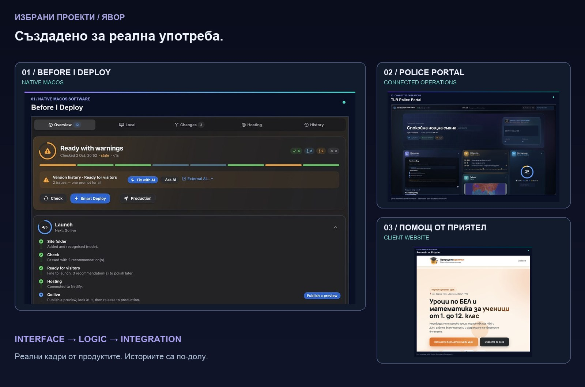
</picture>

[Before I Deploy](#before-i-deploy) · [The Last Republic](#the-last-republic) · [Полицейски портал](#tlr-police-portal) · [Общностна платформа](#общностна-платформа) · [Клиентски сайтове](#клиентски-сайтове)

<picture>
<source media="(max-width: 600px)" srcset="assets/studio/chapter-03-bg-mobile.svg" />
</picture>

## 💼 За какво можете да ме наемете

<table>
<tr>
<td width="50%" valign="top">

### 🌐 Сайтове и онлайн бизнес
Фирмени сайтове, целеви страници, портфолиа, онлайн магазини, интерфейси за резервации и обновяване на съществуващи сайтове.

**Адаптивен дизайн · UI/UX · Интеграции · Производителност**

</td>
<td width="50%" valign="top">

### ⚙️ Софтуер и платформи
Уеб и настолни приложения, табла, административни панели, клиентски портали и вътрешни бизнес инструменти.

**Интерфейс · Сървърна логика · Бази данни · Вход**

</td>
</tr>
<tr>
<td width="50%" valign="top">

### 💬 Discord ботове и общности
Команди, тикети, модерация, роли, известия, дневници на събитията и свързани административни табла.

**Ботове · API · Автоматизация · Сървърни интеграции**

</td>
<td width="50%" valign="top">

### 🎮 Игри и FiveM системи
Игри и прототипи, игрови механики, сървърни ресурси, NUI интерфейси, професии, инвентари и инструменти за екипа.

**Игрова логика · Клиент и сървър · Съхранение на данни**

</td>
</tr>
<tr>
<td width="50%" valign="top">

### 🤖 Автоматизации и AI
Скриптове за повтарящи се задачи, AI функционалности, асистенти, обработка на данни и свързване на услуги.

**API · Webhooks · Скриптове · AI интеграции**

</td>
<td width="50%" valign="top">

### 🛠️ Поддръжка и развитие
Нови функции, поправка на грешки, преработка на код, оптимизация, миграции, подобрения на интерфейса и подготовка за публикуване.

**Съществуващи проекти · Технически подобрения · Поддръжка**

</td>
</tr>
</table>

<b>Разгледайте пълния каталог с услуги</b>

| Област | Примерен обхват |
| :--- | :--- |
| 🌍 **Сайтове** | Фирмени и лични сайтове, портфолиа, кампании, каталози и съдържателни страници |
| 🛒 **Онлайн магазини** | Продукти, поръчки, клиентски профили и интеграции за плащане |
| 📅 **Резервации** | Записване на часове, наличности, напомняния и календари |
| 🧩 **Уеб приложения** | SaaS интерфейси, членски платформи, портали и интерактивни табла |
| 🖥️ **Настолен софтуер** | Помощни програми, инструменти за продуктивност и инсталатори |
| 📱 **Мобилни интерфейси** | Адаптивни сайтове, прогресивни уеб приложения и прототипи |
| 🎨 **UI/UX** | Компоненти, дизайн системи, анимация и достъпност |
| ⚙️ **Сървърна логика** | API услуги, фонови задачи, проверки и интеграции |
| 🗄️ **Бази данни** | Структура, миграции, импорт, експорт и справки |
| 🔐 **Профили и права** | Вход, роли, права на екипа и журнал на действията |
| 🔌 **Интеграции** | Външни услуги, webhooks, известия и свързани процеси |
| 💬 **Discord** | Ботове, команди, тикети, роли, дневници и връзка с игрови сървъри |
| 🎮 **Игри** | Прототипи, игрови функции, браузърни игри и помощни инструменти |
| 🚓 **FiveM** | Ресурси, NUI, професии, полицейски системи и администрация |
| 🏢 **Бизнес софтуер** | CRM инструменти, служители, наличности и оперативни панели |
| 🤖 **AI функции** | AI API, асистенти и работа със съдържание |
| 🔁 **Автоматизация** | Файлове, данни, известия и координация между услуги |
| 🧰 **Инструменти за разработчици** | CLI, проверки на проекти и помощни средства за публикуване |
| 🧪 **Качество** | Тестове, статичен анализ, типове, компилация и диагностика |
| 🚀 **Публикуване и поддръжка** | Среди, CI/CD, наблюдение и последващи подобрения |

**Обхватът се уточнява за всеки проект.** Функциите, платформите, срокът и цената зависят от договорените изисквания. Това са предлагани услуги; конкретният реализиран опит е показан в проектите по-долу.

> **Имате друга идея?** Опишете проблема, потребителите и какво трябва да прави решението.

---

<picture>
<source media="(max-width: 600px)" srcset="assets/studio/chapter-01-bg-mobile.svg" />
</picture>

## 🚀 Избрани проекти

<table>
<tr>
<td width="50%" valign="top">

### 🟣 Before I Deploy
**Проверете, преди да публикувате.**

Инструмент за проверка на проекти: среди, зависимости, статичен анализ, типове, компилация, сигурност и конфигурация.

**Инструменти за разработчици · Автоматизация · Подготовка за публикуване**

</td>
<td width="50%" valign="top">

### 🔵 The Last Republic
Свързана общностна инфраструктура с FiveM, уеб приложения, Discord, бази данни и инструменти за екипа.

**Уеб системи · Игрови общности · Интеграции**

</td>
</tr>
<tr>
<td width="50%" valign="top">

### 🟢 TLR Police Portal
Вътрешен портал за служители, отдели, звания, позивни, сертификати и наказания с права и журнал на действията.

**Управление · Достъп според роля · Интеграции**

</td>
<td width="50%" valign="top">

### 🟠 Клиентски сайтове
Сайтове за **„Помощ от приятел“** и **„Автоинструктор Господинов“**. [Към клиентските проекти](#клиентски-сайтове).

**Бизнес сайтове · UI/UX · Индивидуална разработка**

</td>
</tr>
</table>

Голяма част от изходния код е частен. Тук представям конкретната работа, техническите решения и начина си на работа.

---

## Before I Deploy

**Ясна подготовка за публикуване — от първата проверка до следващото действие.**

Нативно приложение за macOS за преглед на локални уеб проекти, разбиране на предупрежденията и подготовка на тестова или продукционна версия. Разработих SwiftUI интерфейса, командния Node.js модул и връзките между проверките, хостинга и облачните услуги.

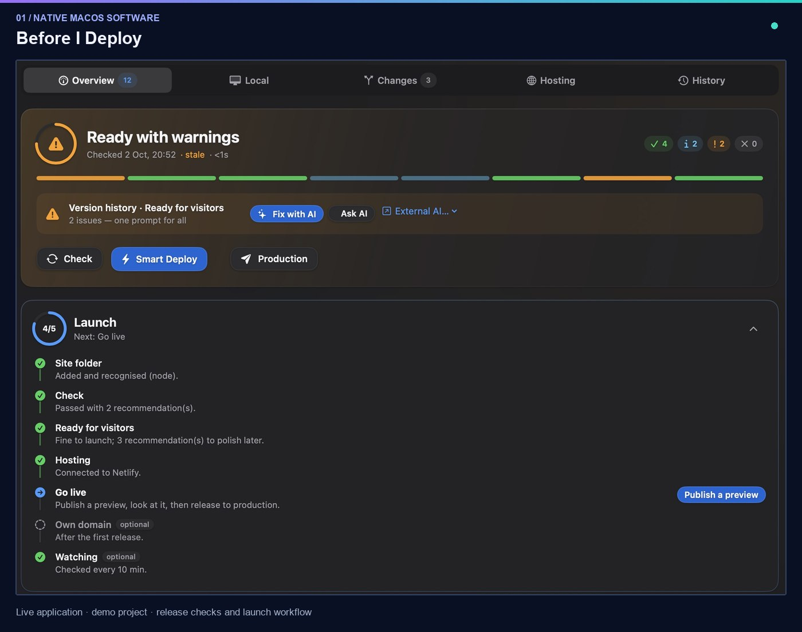

**Какво стои зад интерфейса**

- **Общ процес за проверки:** Git, тайни ключове, зависимости, статичен анализ, типове, компилация и готовност на хостинга. Резултатите стигат до приложението като NDJSON събития.
- **Защити при публикуване:** проверка дали файловете са променени след анализа и изрично потвърждение преди продукционно публикуване.
- **Център за управление:** състояние на проектите, наблюдение на сайтове, SSL информация и командна палитра.
- **AI помощ при поправки:** преглед и прилагане на предложени промени. Работата зависи от настройката на доставчика и достъпността на услугите.

**Технологии:** Swift · SwiftUI · JavaScript · Node.js · Supabase · PostgreSQL · Deno Edge Functions


<b>Разгледайте приложението — Mission Control и командна палитра</b>

### Mission Control

### Командна палитра

Продукт в активно развитие. Снимките са от инсталираното приложение с демонстрационен проект и не означават публично издание или проверка на всяка външна интеграция. Кодът е частен.

[Обсъдете продукта или подобен инструмент →](mailto:Fraisbg1@gmail.com?subject=Before%20I%20Deploy)

## The Last Republic

**Общностен сайт с път от първото посещение до кандидатстването.**

Работата ми включва публичен интерфейс, правила и кандидатстване за FiveM общността, свързано с Discord.

Актуалният адрес и правилната версия на основния сайт се уточняват. Предишните снимки няма да бъдат представяни като актуален сайт.

## TLR Police Portal

**Структурата на екипа, превърната в работно пространство.**

Вътрешен портал за полицейския отдел на TLR. Разработих табло, търсачка на служители, йерархия на званията, наръчник и управление на сертификати, наказания и позивни, със сървърни проверки на правата и журнал на действията.

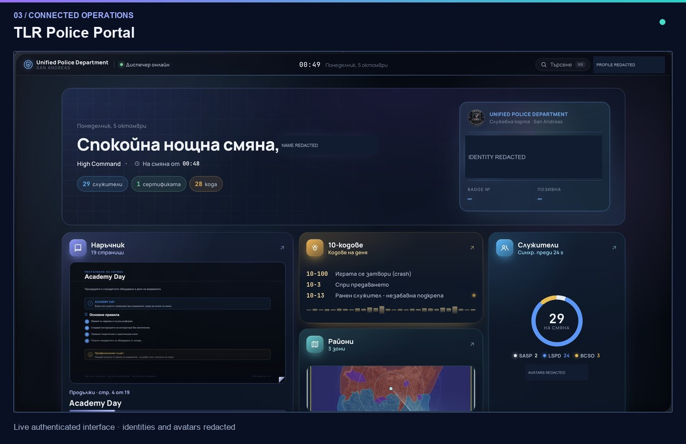

**Техническо решение:** събитията за членство в Discord изискват постоянна връзка. Отделен Node.js бот поддържа Gateway връзката и синхронизира данните за състава в Postgres. Next.js сайтът обработва разрешените административни действия. Двата компонента използват обща карта на ролите.

**Технологии:** TypeScript · Next.js · React · PostgreSQL / Neon · Drizzle ORM · Node.js · discord.js


### Вътре в портала

<b>Отворете галерията — звания и интерактивен наръчник</b>

### Йерархия на званията

### Интерактивен наръчник

<b>Кратка демонстрация на навигацията в наръчника — GIF</b>

<picture>
<source media="(prefers-reduced-motion: reduce)" srcset="assets/screens/police-handbook.jpg" />

</picture>

Три състояния от реална навигация с паузи за четене. Интерфейсът и данните не са измислени.

Снимки от предишната проверка на портала. Достъпът изисква Discord вход и членство в отдела. Актуалната връзка се уточнява; кодът е частен.

## Общностна платформа

**Общо място за информацията, правилата и потребителските пътища на игрова общност.**

Хранилището `chillrp-website` съдържа отделна React реализация с TLR RP брандинг и Minecraft SMP и Factions интерфейс. Тази галерия показва локално стартирания код, а не актуалния основен сайт на The Last Republic.

<b>Разгледайте локалния интерфейс от прегледания код</b>

**Технически решения:** React Router за навигацията, зареждане на страниците при нужда и React Query за кеширане на отдалечените данни. Кодът включва Supabase интеграции за вход, данни и сървърни функции.

**Технологии:** TypeScript · React · Vite · Tailwind CSS · shadcn/ui · React Router · TanStack Query · Supabase

**Изходният код е частен.**

Снимките са от непроменения интерфейс, стартиран локално без продукционните услуги. Адресите и статусите са стойности по подразбиране от кода. Не представят проверен работещ сървър, плащане или публичен вход.

### Експеримент — Space Control

Браузърен експеримент за симулирано наблюдение на ресурси и управление. Прегледаният код в `fraisbg1` съдържа HTML екрани, Canvas елементи и препратки към JavaScript файлове за предвидените взаимодействия.

**Технологии:** HTML · JavaScript · Canvas API

**Изходният код е частен.**

Представяне само на кода: липсват посочени файлове за оформление и скриптове. За пълна визуална демонстрация са нужни тези файлове или работещ адрес.

<picture>
<source media="(max-width: 600px)" srcset="assets/studio/chapter-02-bg-mobile.svg" />
</picture>

## Клиентски сайтове

### Помощ от приятел · Образователен център

Клиентски сайт, който помага на родителите да разгледат уроците по БЕЛ и математика и да изпратят запитване. Публичният интерфейс включва формати на обучение, често задавани въпроси и форма за контакт.

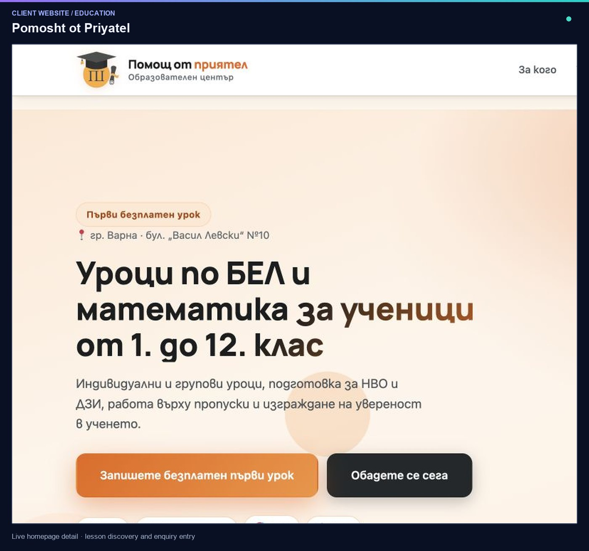

**Проверени компоненти:** WordPress · WPForms. Формата е прегледана без изпращане на лични данни.

<b>Разгледайте интерактивните въпроси</b>

[Посетете Помощ от приятел →](https://pomoshtotpriyatel.com/)

### Автоинструктор Господинов · Шофьорски курсове

Клиентски сайт за онлайн представяне на автоинструктор.

Връзката, актуалните снимки, точният обхват и технологиите предстои да бъдат проверени.

<picture>
<source media="(max-width: 600px)" srcset="assets/studio/chapter-04-bg-mobile.svg" />
</picture>

## 🌈 Езици и технологии

### Технологии от представените проекти


**Before I Deploy:** Swift · SwiftUI · JavaScript · Node.js · Supabase · PostgreSQL · Deno Edge Functions 
**Проверена TLR реализация и полицейски портал:** TypeScript · React · Next.js · Tailwind CSS · Drizzle · Neon / PostgreSQL · discord.js 
**Общностна платформа:** React · Vite · shadcn/ui · React Router · TanStack Query · Supabase 
**Space Control:** HTML · JavaScript · Canvas

<b>Още технологии и области, които проучвам</b>

Колекцията по-долу показва допълнителни интереси и възможни технологични избори. Тя не означава завършени продукти или еднакъв опит с всеки инструмент. Технологиите от проверените реализации са посочени при проектите.

### Допълнителни инструменти и интереси

### Други програмни езици

Езици, които проучвам и разглеждам като възможности за бъдещи проекти. Подходящият избор зависи от продукта; значките не означават еднаква специализация.

### Уеб технологии и приложения

### Данни, инфраструктура и публикуване

### Игри, общности и AI

Това са технологии, свързани с интересите ми и възможни бъдещи изисквания. Конкретните инструменти и обхват се уточняват за всеки проект.

---

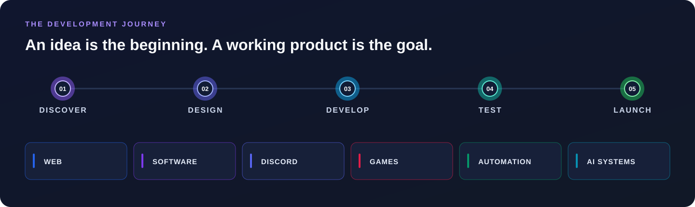

<picture>
<source media="(max-width: 600px)" srcset="assets/studio/chapter-05-bg-mobile.svg" />
</picture>

## 🧭 От вашата идея до работещ продукт

| 01 · Проучване | 02 · Дизайн | 03 · Разработка | 04 · Проверка | 05 · Публикуване |
| :--- | :--- | :--- | :--- | :--- |
| Цели, потребители и изисквания | Интерфейс, архитектура и обхват | Функции и интеграции | Поведение, грешки и готовност | Публикуване, документация и следващи подобрения |

### Какво е важно в работата ми

**🎯 Дизайн с цел** — интерфейс според нуждите на хората. 
**🧱 Ясна архитектура** — разбираем код, който може да се развива. 
**🔐 Обмислени права** — проверки и контрол на достъпа. 
**🧪 Практически проверки** — тестове и диагностика преди публикуване. 
**🔁 Полезна автоматизация** — по-малко повтаряща се работа. 
**🤝 Ясен обхват** — договорени изисквания, резултати и очаквания.

<picture>
<source media="(max-width: 600px)" srcset="assets/studio/chapter-06-bg-mobile.svg" />
</picture>

## 📬 Нека обсъдим вашия проект

### Сайт, инструмент, бот или следващата ви идея.

**Разкажете ми какво искате да създадете. Нека уточним как да го реализираме.**

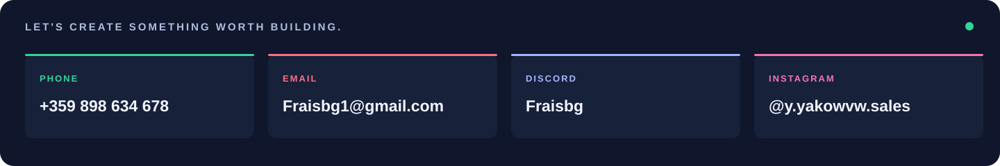

| Контакт | Намерете ме тук |
| :--- | :--- |
| 📞 **Телефон** | +359 898 634 678 |
| ✉️ **Имейл** | [Fraisbg1@gmail.com](mailto:Fraisbg1@gmail.com) |
| 💬 **Discord** | **Fraisbg** |
| 📸 **Instagram** | [@y.yakowvw.sales](https://www.instagram.com/y.yakowvw.sales/) |

**Приемам платени поръчки за сайтове, софтуер, Discord ботове, игри и индивидуална разработка.**

Изпратете идеята, основните функции, желания срок и ориентировъчен бюджет. Ще уточним обхвата и индивидуална оферта.

---

### Вашата идея. Ясен план. Работещ софтуер.

**СЪЗДАВАНЕ · ТЕСТВАНЕ · ПРОВЕРКА · ПУБЛИКУВАНЕ · РАЗВИТИЕ**

[EN · English](https://github.com/yavordfgggdag) · **BG · Български**

Реални снимки и визуални материали в хранилището. [Произход на снимките и бележки за достъпност](assets/README.md). Оригиналният банер и текстът в заснетите интерфейси са запазени.

Изходният код на проектите е частен; профилът показва подбрани реални интерфейси.
