
<a href="https://github.com/yavordfgggdag">EN · English</a> &nbsp; / &nbsp; <b>BG · Български</b>

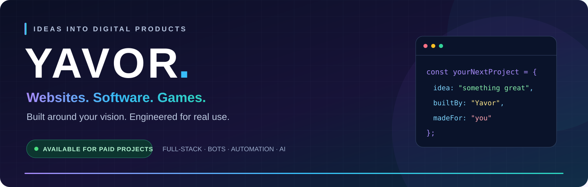

**Аз съм Явор.** Разработвам уеб и настолен софтуер, сайтове и инструменти за бизнеси и общности.

**Приемам платени проекти.** [Нека обсъдим вашия →](mailto:Fraisbg1@gmail.com)

[Работа](#work) · [Езици и инструменти](#toolkit) · [Услуги](#services) · [Активност](#activity) · [Контакт](#contact)

## Before I Deploy

<picture>
<source media="(max-width: 600px)" srcset="assets/journal/screens/bid-mobile.svg" />
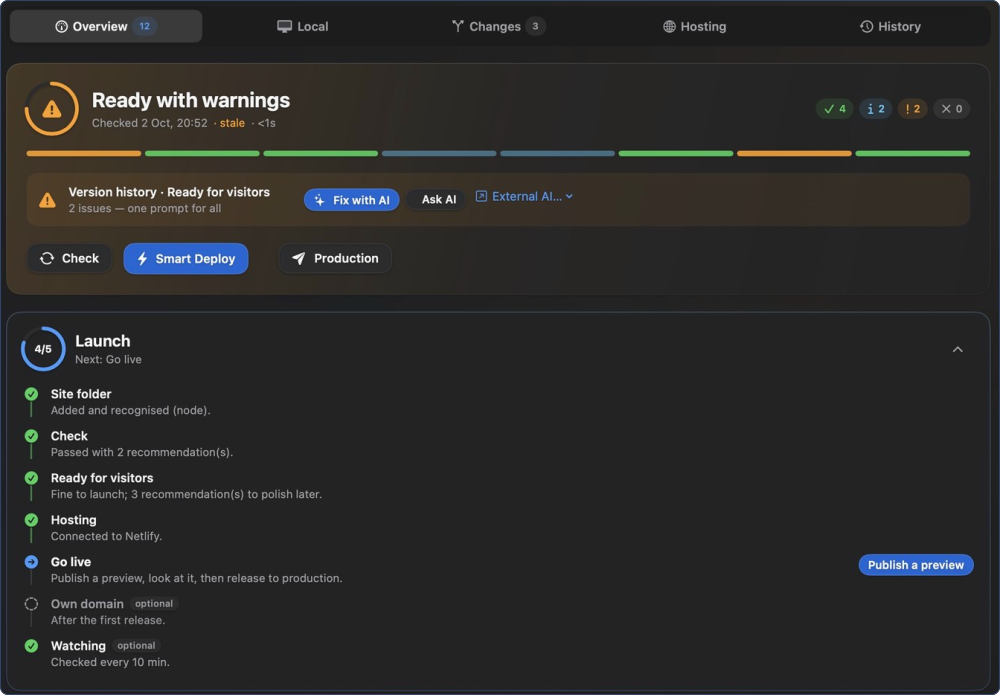
</picture>

Нативно macOS приложение за проверки и подготовка на уеб проекти за публикуване.

Реален кадър от разработката. При тесен екран: увеличен детайл от desktop интерфейса. [Целият кадър](assets/screens/before-i-deploy.jpg).

**Нативен интерфейс. Отделен модул за проверки.** Разработих SwiftUI интерфейса, командния Node.js модул и връзките между проверките, хостинга и облачните услуги. Резултатите достигат до приложението като NDJSON събития.

<picture>
<source media="(max-width: 600px)" srcset="assets/journal/native-bg-mobile.svg" />
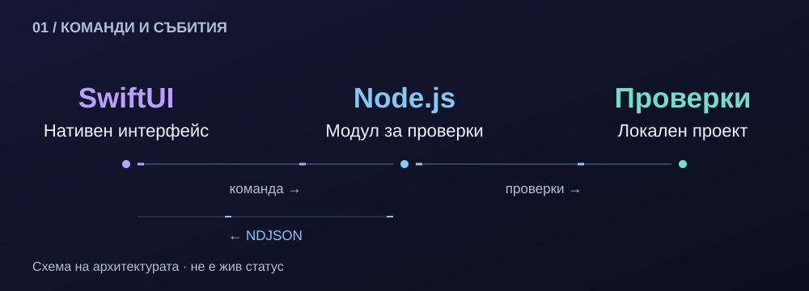
</picture>

**Техническите решения:** Git състояние, тайни ключове, зависимости, статичен анализ, типове, компилация и готовност на хостинга в общ процес; проверка за променени файлове след анализа; изрично потвърждение преди продукционно публикуване.

**Технологии:** Swift · SwiftUI · JavaScript · Node.js · Supabase · PostgreSQL · Deno Edge Functions

<b>Галерия и още функционалности</b>

Mission Control обединява състоянието на проектите, наблюдението на сайтове и SSL информацията. Командната палитра предоставя бърза навигация.

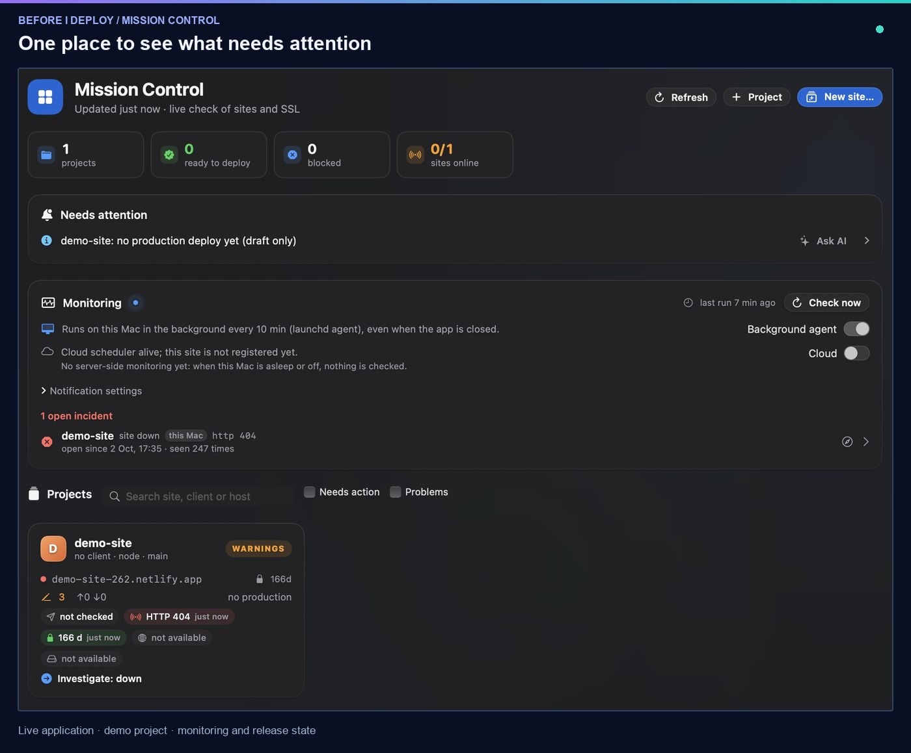

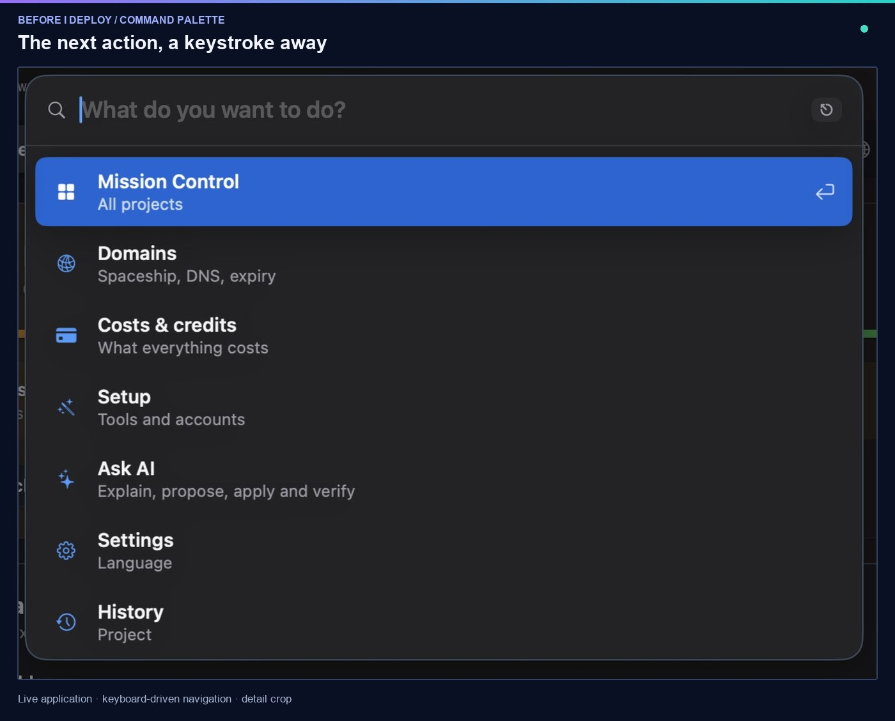

**AI помощ:** преглед и прилагане на предложени промени. Достъпността зависи от настройките на доставчика и външните услуги.

Продукт в активно развитие, с частен код. Снимките не означават публично издание или проверка на всяка външна интеграция.

---

## TLR Police Portal

Вътрешен портал за полицейския отдел на FiveM roleplay общността The Last Republic. Разработих таблото, търсачката на служители, йерархията на званията, наръчника и управлението на сертификати, наказания и позивни.

<picture>
<source media="(max-width: 600px)" srcset="assets/journal/screens/police-mobile.svg" />
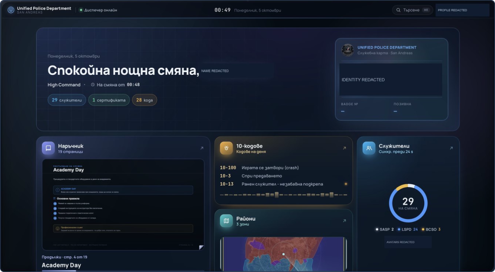
</picture>

На тесен екран: детайл с радиокодовете от същия кадър. [Цялото табло](assets/screens/police-dashboard.jpg).

**Постоянната връзка има собствен процес.** Отделен Node.js бот поддържа Discord Gateway връзката и синхронизира данните за състава в Postgres. Next.js порталът извършва административните действия със сървърни проверки на правата и журнал. Двата компонента използват обща карта на ролите.

<picture>
<source media="(max-width: 600px)" srcset="assets/journal/sync-bg-mobile.svg" />

</picture>

**Технологии:** TypeScript · Next.js · React · Tailwind CSS · PostgreSQL / Neon · Drizzle ORM · Node.js · discord.js

<b>Галерия — състав, звания и наръчник</b>

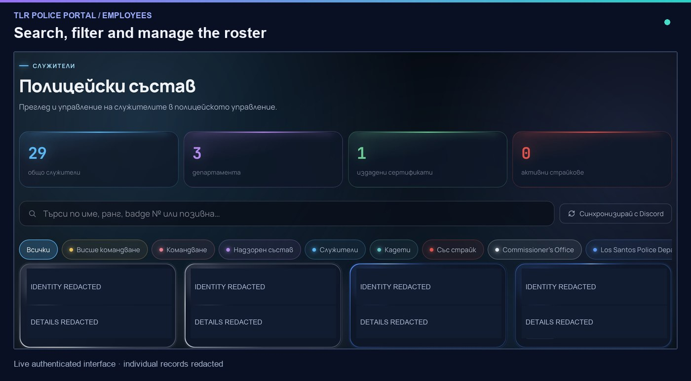

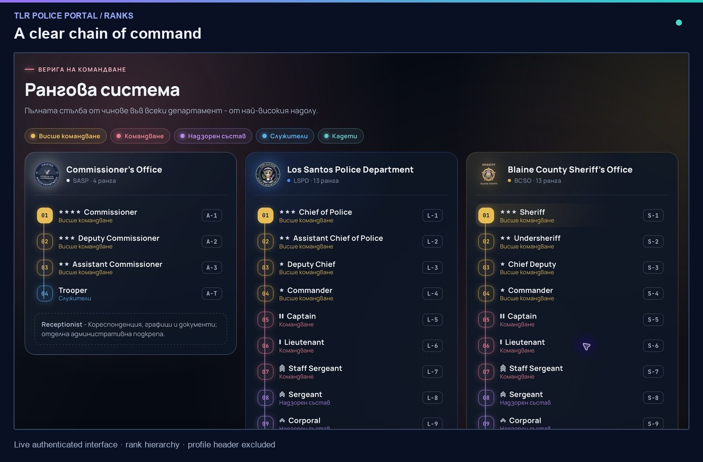

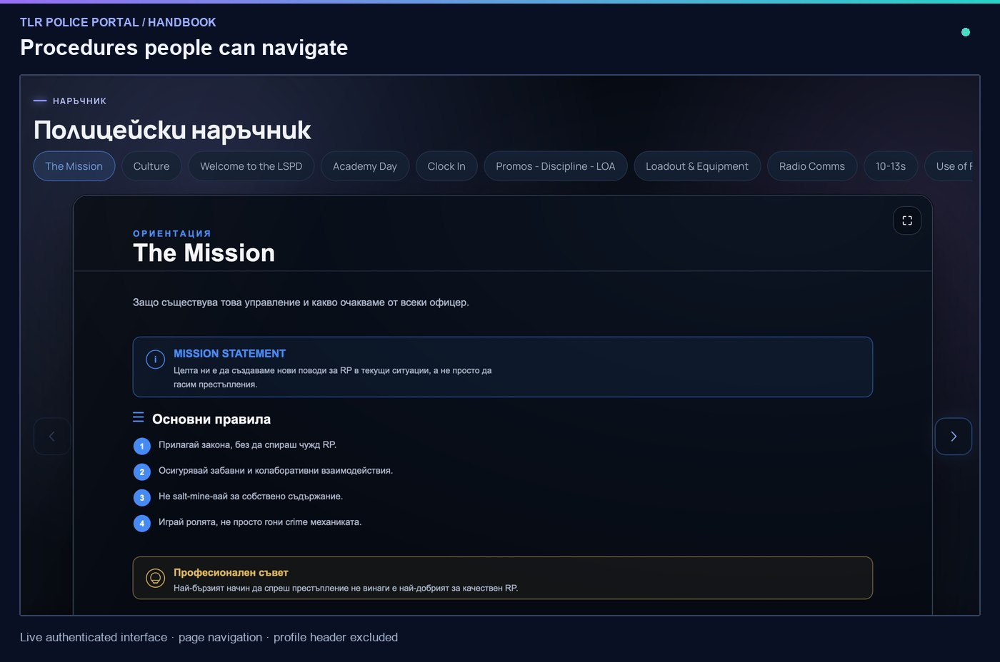

<b>Реална навигация в наръчника — кратък GIF</b>

<picture>
<source media="(prefers-reduced-motion: reduce)" srcset="assets/screens/police-handbook.jpg" />
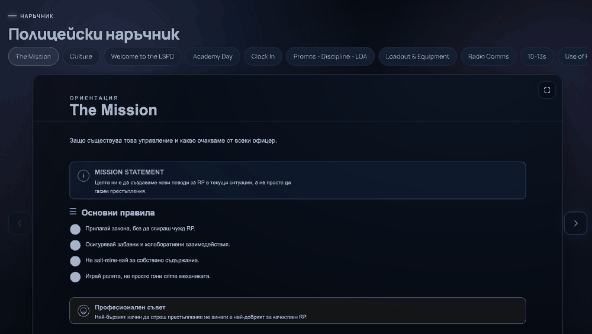
</picture>

[Статичен кадър](assets/screens/police-handbook.jpg).

Кадри от предишната проверка. Достъпът изисква Discord вход и членство в отдела. Актуалният вход се уточнява; кодът е частен.

---

## Клиентска работа

### Помощ от приятел · Образователен център

Сайт, който помага на родителите да разгледат уроците по БЕЛ и математика и да изпратят запитване. Включва формати на обучение, често задавани въпроси и форма за контакт.

<picture>
<source media="(max-width: 600px)" srcset="assets/journal/screens/education-mobile.svg" />
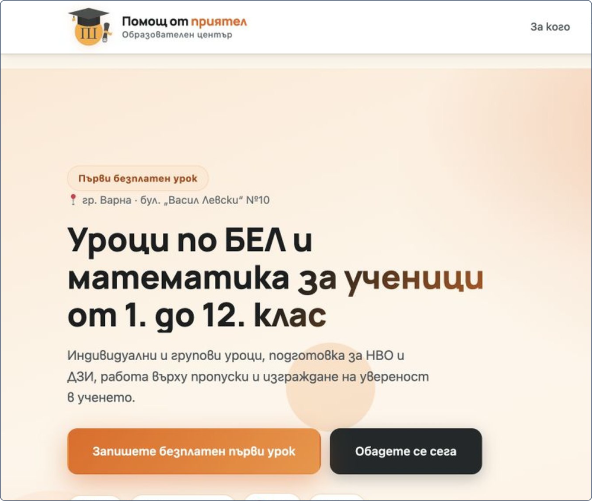
</picture>

**Компоненти, документирани при предишния преглед:** WordPress · WPForms. Формата е разгледана без изпращане на лични данни.

[Посетете сайта →](https://pomoshtotpriyatel.com/) · [Целият кадър](assets/screens/client-education.jpg)

<b>Въпроси и отговори — реален кадър</b>

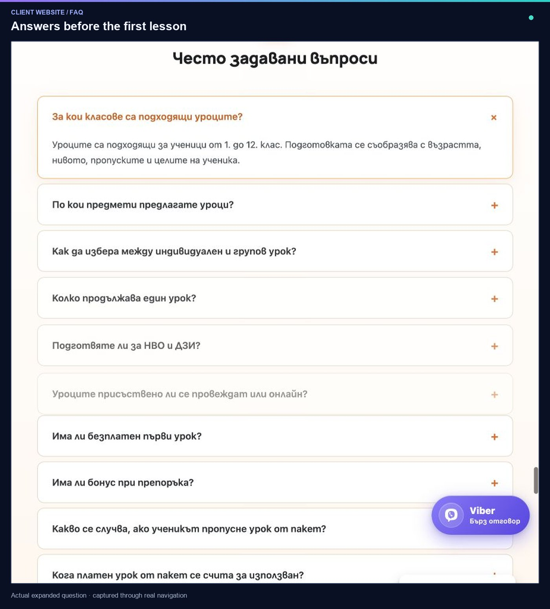

### Автоинструктор Господинов

Клиентски сайт за онлайн представяне на автоинструктор. **Очаква потвърждение:** точен адрес, актуални снимки, обхват и технологии.

### The Last Republic

Основен сайт за FiveM общността. Работата включва публичен интерфейс, правила и кандидатстване, свързано с Discord. **Актуалният адрес и версия предстои да се потвърдят.** Старите начални страници и Minecraft интерфейсът не се представят като текущия основен сайт.

<b>Допълнителна работа и експерименти</b>

**Общностна платформа.** Отделна React реализация с Minecraft SMP и Factions интерфейс. Техническите решения включват React Router, зареждане на страници при нужда, TanStack Query и Supabase интеграции. Снимките са от локален преглед без продукционните услуги; не доказват работещ сървър, плащане или публичен вход.

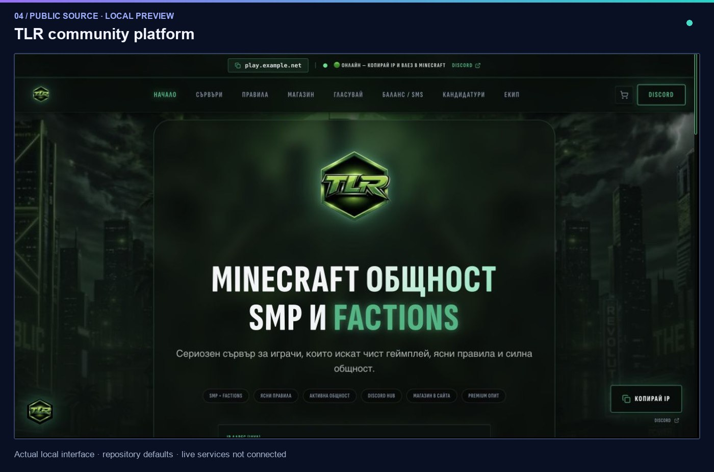

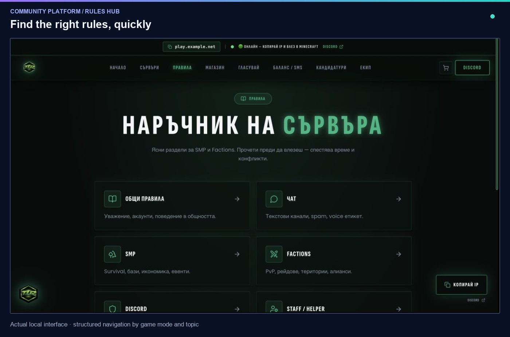

**Технологии:** TypeScript · React · Vite · Tailwind CSS · shadcn/ui · React Router · TanStack Query · Supabase.

**Space Control.** Експеримент с HTML, JavaScript и Canvas API. В предишния преглед липсват посочени файлове за оформление и скриптове; не е представен като завършен продукт. Кодът на тези проекти е частен.

---

## Езици, инструменти и среда за разработка

<picture>
<source media="(max-width: 600px)" srcset="assets/journal/toolkit-bg-mobile.svg" />

</picture>

### Реализиран опит — свързан с конкретна работа

| Контекст | Инструменти и роля |
| :--- | :--- |
| Нативно приложение | Swift / SwiftUI — macOS интерфейс; Node.js / JavaScript — проверки; NDJSON — събития |
| Портал и интеграции | TypeScript / React / Next.js — интерфейс и сървърна логика; Tailwind CSS — оформление; discord.js — бот |
| Данни и облачни услуги | PostgreSQL / Neon / Drizzle; Supabase / Deno Edge Functions — според проекта |
| Клиентски сайт | WordPress / WPForms — документираните компоненти на „Помощ от приятел“ |

### Пълна колекция — допълнителни технологии и интереси

Запазен е целият набор от езици и инструменти от профила. Тази колекция включва допълнителни интереси и възможни технологични избори; не означава еднакъв опит или завършени продукти с всеки инструмент. Реализираният опит е посочен по-горе.

**Допълнителни инструменти и интереси**  
TypeScript · JavaScript · Python · Lua · HTML5 · CSS3 · SQL · Node.js · Astro · MySQL · MariaDB · Git · GitHub

**Други програмни езици**  
C · C++ · C# · Java · Kotlin · Swift · Go · Rust · PHP · Ruby · Dart · Scala · R · Bash · PowerShell · Elixir · Erlang · Haskell · Clojure · F# · Julia · Zig · Solidity · GDScript · Objective-C · Perl · OCaml

**Уеб технологии и приложения**  
React · Next.js · Vue.js · Svelte · Vite · Tailwind CSS · Express · Electron · Flutter · .NET

**Данни, инфраструктура и публикуване**  
PostgreSQL · SQLite · MongoDB · Redis · Docker · Linux · macOS · Netlify · GitHub Actions · NGINX

**Игри, общности и AI**  
Discord · FiveM · Godot · Unity · Unreal Engine · OpenAI · Claude · Cursor

---

## За какво можете да ме наемете

- **Сайтове и онлайн магазини:** фирмено представяне, каталози, поръчки и резервации.
- **Уеб и настолен софтуер:** административни панели, портали и вътрешни инструменти.
- **Discord, игри и FiveM:** ботове, игрови системи и инструменти за общности.
- **API, автоматизации и AI:** свързване на услуги, обработка на данни и AI функционалности.
- **Поддръжка и развитие:** нови функции, поправки, оптимизация и подготовка за публикуване.

Това са **предлагани услуги**. Обхватът, срокът и цената се уточняват за конкретния проект.

<b>Разгледайте пълния каталог с услуги</b>

| Област | Примерен обхват |
| :--- | :--- |
| 🌍 **Сайтове** | Фирмени и лични сайтове, портфолиа, кампании, каталози и съдържателни страници |
| 🛒 **Онлайн магазини** | Продукти, поръчки, клиентски профили и интеграции за плащане |
| 📅 **Резервации** | Записване на часове, наличности, напомняния и календари |
| 🧩 **Уеб приложения** | SaaS интерфейси, членски платформи, портали и интерактивни табла |
| 🖥️ **Настолен софтуер** | Помощни програми, инструменти за продуктивност и инсталатори |
| 📱 **Мобилни интерфейси** | Адаптивни сайтове, прогресивни уеб приложения и прототипи |
| 🎨 **UI/UX** | Компоненти, дизайн системи, анимация и достъпност |
| ⚙️ **Сървърна логика** | API услуги, фонови задачи, проверки и интеграции |
| 🗄️ **Бази данни** | Структура, миграции, импорт, експорт и справки |
| 🔐 **Профили и права** | Вход, роли, права на екипа и журнал на действията |
| 🔌 **Интеграции** | Външни услуги, webhooks, известия и свързани процеси |
| 💬 **Discord** | Ботове, команди, тикети, роли, дневници и връзка с игрови сървъри |
| 🎮 **Игри** | Прототипи, игрови функции, браузърни игри и помощни инструменти |
| 🚓 **FiveM** | Ресурси, NUI, професии, полицейски системи и администрация |
| 🏢 **Бизнес софтуер** | CRM инструменти, служители, наличности и оперативни панели |
| 🤖 **AI функции** | AI API, асистенти и работа със съдържание |
| 🔁 **Автоматизация** | Файлове, данни, известия и координация между услуги |
| 🧰 **Инструменти за разработчици** | CLI, проверки на проекти и помощни средства за публикуване |
| 🧪 **Качество** | Тестове, статичен анализ, типове, компилация и диагностика |
| 🚀 **Публикуване и поддръжка** | Среди, CI/CD, наблюдение и последващи подобрения |

**Обхватът се уточнява за всеки проект.** Функциите, платформите, срокът и цената зависят от договорените изисквания. Това са предлагани услуги; конкретният реализиран опит е показан в проектите по-долу.

---

## Активност и обем код

<picture>
<source media="(max-width: 600px)" srcset="assets/journal/metrics/activity-bg-mobile.svg" />

</picture>

<picture>
<source media="(max-width: 600px)" srcset="assets/journal/metrics/languages-bg-mobile.svg" />
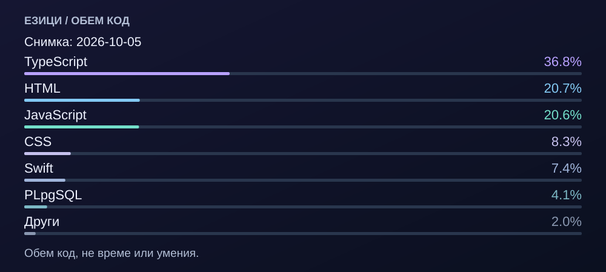
</picture>

<b>Как се изчисляват показателите</b>

Активността се обновява ежедневно от публичния календар на GitHub. Приносите не са само commit-и и не показват часове работа. „Последен принос“ е последният активен ден в календара, а не последно влизане в профила. GitHub може да обновява календара със закъснение.

Текущата поредица брои последователните активни дни до днес или вчера, ако днешният ден още няма принос. Най-дългата поредица, приносите и активните дни са в показания годишен период. Мобилният календар показва последните 26 седмици; общите показатели остават за годишния период.

Езиковите дялове са отделна снимка от 2026-10-05 на обема код според GitHub, включително частните проекти и без профилното хранилище. Това не измерва честота, време или умения. Езиковата снимка не се обновява автоматично: публичната задача няма достъп до частния код.

[GitHub contribution rules](https://docs.github.com/en/account-and-profile/reference/profile-contributions-reference) · [Metrics source](scripts/update_metrics.py)

---

## Как работим заедно

<picture>
<source media="(max-width: 600px)" srcset="assets/journal/process-bg-mobile.svg" />

</picture>

Започваме с целите, потребителите и изискванията. Уточняваме интерфейса, архитектурата и обхвата; разработваме функциите и интеграциите; проверяваме поведението и подготовката за публикуване. Следват документация и договорените подобрения.

<b>Принципи на работа</b>

Дизайн според нуждите на хората · Ясна архитектура · Обмислени права и контрол на достъпа · Практически проверки · Полезна автоматизация · Договорени изисквания и очаквания.

---

## Нека обсъдим вашия проект.

Изпратете **идеята, основните функции, желания срок и ориентировъчния бюджет**. Ще уточним обхвата и индивидуална оферта.

**[Fraisbg1@gmail.com](mailto:Fraisbg1@gmail.com)**  
Телефон: **+359898634678**  
Discord: **Fraisbg**  
Instagram: **[@y.yakowvw.sales](https://www.instagram.com/y.yakowvw.sales/)**

[EN · English](https://github.com/yavordfgggdag) · **BG · Български**

Изходният код на проектите е частен. [Произход на кадрите и бележки за достъпност](assets/README.md). Оригиналният банер и оригиналните изображения са запазени.
