
<b>EN · English</b> &nbsp; / &nbsp; <a href="README.bg.md">BG · Български</a>

**I’m Yavor.** I build web and desktop software, websites and tools for businesses and communities.

**Available for paid projects.** [Let’s discuss yours →](mailto:Fraisbg1@gmail.com)

[Work](#work) · [Languages & tools](#toolkit) · [Services](#services) · [Activity](#activity) · [Contact](#contact)

<picture>
<source media="(max-width: 600px)" srcset="assets/journal/intro-en-mobile.svg" />
</picture>

## Before I Deploy

<picture>
<source media="(max-width: 600px)" srcset="assets/journal/screens/bid-mobile.svg" />

</picture>

A native macOS application for checking web projects and preparing them for release.

Real development capture. On narrow screens: a closer desktop detail. [Full capture](assets/screens/before-i-deploy.jpg).

**A native interface. A separate check engine.** I developed the SwiftUI interface, the Node.js command engine and the connections between checks, hosting and cloud services. Results reach the app as NDJSON events.

<picture>
<source media="(max-width: 600px)" srcset="assets/journal/native-en-mobile.svg" />
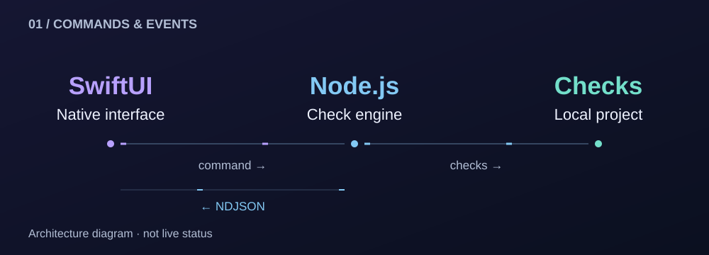
</picture>

**Engineering decisions:** one pipeline for Git state, secrets, dependencies, lint, types, build and hosting readiness; a check for changed project fingerprints after analysis; explicit confirmation before production deployment.

**Built with:** Swift · SwiftUI · JavaScript · Node.js · Supabase · PostgreSQL · Deno Edge Functions

<b>Gallery & additional functionality</b>

Mission Control brings together project status, site monitoring and SSL information. The command palette provides keyboard navigation.

**AI-assisted repair:** review and apply proposed changes. Availability depends on provider configuration and external services.

Actively developed product with private source. Captures do not imply a public release or validation of every external integration.

---

## TLR Police Portal

An internal portal for the police department of The Last Republic’s FiveM roleplay community. I developed the dashboard, searchable staff directory, rank hierarchy, handbook and management workflows for certificates, strikes and callsigns.

<picture>
<source media="(max-width: 600px)" srcset="assets/journal/screens/police-mobile.svg" />

</picture>

On narrow screens: the radio-code detail from the same capture. [Full dashboard](assets/screens/police-dashboard.jpg).

**The persistent connection has its own process.** A separate Node.js bot maintains the Discord Gateway connection and synchronizes roster data into Postgres. The Next.js portal performs management actions with server-side access checks and audit records. Both components use a shared role map.

<picture>
<source media="(max-width: 600px)" srcset="assets/journal/sync-en-mobile.svg" />
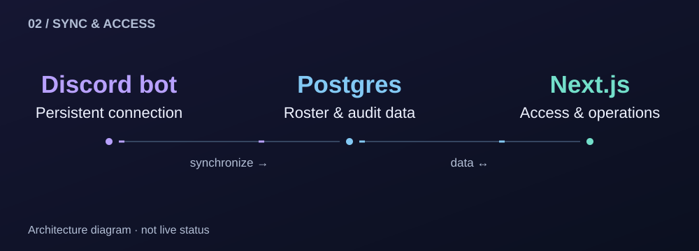
</picture>

**Built with:** TypeScript · Next.js · React · Tailwind CSS · PostgreSQL / Neon · Drizzle ORM · Node.js · discord.js

<b>Gallery — staff, ranks & handbook</b>

<b>Actual handbook navigation — short GIF</b>

<picture>
<source media="(prefers-reduced-motion: reduce)" srcset="assets/screens/police-handbook.jpg" />

</picture>

[Static capture](assets/screens/police-handbook.jpg).

Captures from the earlier review. Access requires Discord authentication and department membership. Current entry URL is being confirmed; source is private.

---

## Client work

### Помощ от приятел · Educational centre

A website that helps parents explore Bulgarian-language and mathematics lessons and send an enquiry. Includes course formats, an FAQ and a contact form.

<picture>
<source media="(max-width: 600px)" srcset="assets/journal/screens/education-mobile.svg" />

</picture>

**Components documented in the earlier review:** WordPress · WPForms. The form was inspected without submitting personal data.

[Visit the website →](https://pomoshtotpriyatel.com/) · [Full capture](assets/screens/client-education.jpg)

<b>FAQ — actual capture</b>

### Автоинструктор Господинов · Driving instructor

A client website providing an online presence for a driving instructor. **Awaiting verification:** exact URL, current captures, scope and technology.

### The Last Republic

Main website for the FiveM community. The work includes the public interface, rules and Discord-connected application journeys. **The current URL and version are awaiting confirmation.** Earlier homepages and the Minecraft interface are not presented as the current main website.

<b>Additional work & experiments</b>

**Community platform.** A separate React implementation with a Minecraft SMP and Factions interface. Technical choices include React Router, lazy-loaded routes, TanStack Query and Supabase integrations. Captures are from a local review with production services disconnected; they do not verify a live server, checkout or public sign-in.

**Technology:** TypeScript · React · Vite · Tailwind CSS · shadcn/ui · React Router · TanStack Query · Supabase.

**Space Control.** An experiment with HTML, JavaScript and Canvas API. Referenced styles and scripts were missing in the earlier review; it is not presented as a completed product. These projects have private source.

---

## Languages, tools & development environment

<picture>
<source media="(max-width: 600px)" srcset="assets/journal/toolkit-en-mobile.svg" />
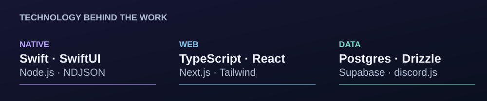
</picture>

### Implemented experience — connected to specific work

| Context | Tools and role |
| :--- | :--- |
| Native application | Swift / SwiftUI — macOS interface; Node.js / JavaScript — checks; NDJSON — events |
| Portal and integrations | TypeScript / React / Next.js — interface and server logic; Tailwind CSS — styling; discord.js — bot |
| Data and cloud services | PostgreSQL / Neon / Drizzle; Supabase / Deno Edge Functions — depending on the project |
| Client website | WordPress / WPForms — documented components of Помощ от приятел |

### Full collection — additional technologies & interests

The profile’s complete language and tool collection is retained. It includes additional interests and possible technology choices; it does not imply equal experience or completed products with every tool. Implemented experience is identified above.

### Additional Tools & Interests

<picture>
<source media="(max-width: 600px)" srcset="assets/journal/collection-0-en-mobile.svg" />
</picture>

TypeScript · JavaScript · Python · Lua · HTML5 · CSS3 · SQL · Node.js · Astro · MySQL · MariaDB · Git · GitHub

### Wider Programming Language Ecosystem

<picture>
<source media="(max-width: 600px)" srcset="assets/journal/collection-1-en-mobile.svg" />
</picture>

C · C++ · C# · Java · Kotlin · Swift · Go · Rust · PHP · Ruby · Dart · Scala · R · Bash · PowerShell · Elixir · Erlang · Haskell · Clojure · F# · Julia · Zig · Solidity · GDScript · Objective-C · Perl · OCaml

### Web & Application Ecosystem

<picture>
<source media="(max-width: 600px)" srcset="assets/journal/collection-2-en-mobile.svg" />
</picture>

React · Next.js · Vue.js · Svelte · Vite · Tailwind CSS · Express · Electron · Flutter · .NET

### Data, Infrastructure & Delivery

<picture>
<source media="(max-width: 600px)" srcset="assets/journal/collection-3-en-mobile.svg" />
</picture>

PostgreSQL · SQLite · MongoDB · Redis · Docker · Linux · macOS · Netlify · GitHub Actions · NGINX

### Games, Communities & AI

<picture>
<source media="(max-width: 600px)" srcset="assets/journal/collection-4-en-mobile.svg" />
</picture>

Discord · FiveM · Godot · Unity · Unreal Engine · OpenAI · Claude · Cursor

---

## What you can hire me for

- **Websites and online stores:** business websites, catalogues, orders and bookings.
- **Web and desktop software:** admin panels, portals and internal tools.
- **Discord, games and FiveM:** bots, game systems and community tools.
- **APIs, automation and AI:** connected services, data processing and AI functionality.
- **Maintenance and development:** features, fixes, optimization and release preparation.

These are **offered services**. Scope, timeline and pricing are agreed for each project.

<b>Explore the full development service catalogue</b>

| Development area | Project types and scope |
| :--- | :--- |
| 🌍 **Websites** | Company sites, personal brands, portfolios, landing pages, campaign pages, directories and content sites |
| 🛒 **E-commerce** | Product catalogues, storefronts, checkout integrations, customer accounts and order-management tools |
| 📅 **Booking & Scheduling** | Appointment flows, availability interfaces, reservation systems, reminders and calendar integrations |
| 🧩 **Web Applications** | SaaS interfaces, membership platforms, customer portals, collaboration tools and interactive dashboards |
| 🖥️ **Desktop Software** | Custom utilities, launchers, productivity tools, installers and desktop interfaces |
| 📱 **Mobile Experiences** | Responsive mobile interfaces, progressive web apps and mobile-focused prototypes |
| 🎨 **Frontend & UI/UX** | Interface design and implementation, component libraries, design systems, animation and accessibility improvements |
| ⚙️ **Backend Systems** | Application logic, API services, background tasks, validation and integrations |
| 🗄️ **Databases** | Schema design, migrations, import/export tools, persistence, reporting and query optimization |
| 🔐 **Accounts & Permissions** | Sign-in flows, user profiles, role-based access, staff permissions and audit trails |
| 🔌 **APIs & Integrations** | Third-party services, webhooks, payment-provider integrations, notifications and connected workflows |
| 💬 **Discord Development** | Bots, commands, moderation, tickets, role systems, logs, dashboards and game-server connections |
| 🎮 **Games & Interactive Projects** | Game prototypes, gameplay features, browser games, interfaces and supporting tools |
| 🚓 **FiveM Development** | Custom resources, NUI, jobs, police/government systems, administration and database-connected features |
| 🏢 **Business Software** | CRM-style tools, employee management, inventory workflows, operations panels and custom internal systems |
| 🤖 **AI Features** | AI API integrations, assistants, content workflows and AI-supported product features |
| 🔁 **Automation & Scripting** | Task automation, file processing, data transformation, notifications and service orchestration |
| 🧰 **Developer Tools** | CLI tools, project validators, release utilities, debugging tools and workflow helpers |
| 🧪 **Testing & Quality** | Test setup, regression checks, linting, type checking, build validation and bug investigation |
| 🚀 **Deployment & Maintenance** | Environment setup, CI/CD workflows, release preparation, monitoring integrations and ongoing improvements |

**Every project is scoped individually.** Features, platform support, integrations, delivery time and pricing depend on the requirements we agree on.

---

## Activity & code volume

<picture>
<source media="(max-width: 600px)" srcset="assets/journal/metrics/activity-en-mobile.svg" />
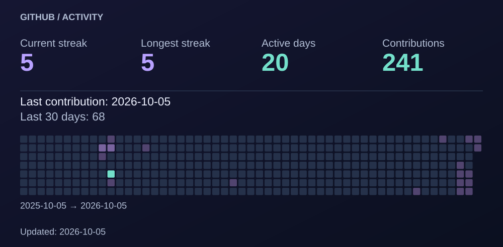
</picture>

<picture>
<source media="(max-width: 600px)" srcset="assets/journal/metrics/languages-en-mobile.svg" />
</picture>

<b>How these numbers are calculated</b>

Activity refreshes daily from the public GitHub contribution calendar. Contributions are not just commits and do not measure hours worked. “Last contribution” is the last active calendar day, not the last login. GitHub may update the calendar with a delay.

The current streak counts consecutive active days ending today, or yesterday when today has no contribution yet. Longest streak, contribution totals and active days refer to the displayed annual window. The mobile heatmap shows the last 26 weeks; headline totals still use the annual window.

Language shares are a separate 2026-10-05 snapshot of GitHub-reported code bytes, including private projects and excluding this profile repository. They do not measure frequency, time or proficiency. The language snapshot is not refreshed automatically: the public workflow has no access to private code.

[GitHub contribution rules](https://docs.github.com/en/account-and-profile/reference/profile-contributions-reference) · [Metrics source](scripts/update_metrics.py)

---

## How we work together

<picture>
<source media="(max-width: 600px)" srcset="assets/journal/process-en-mobile.svg" />
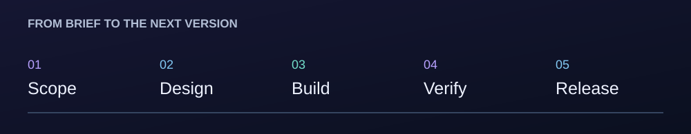
</picture>

We start with goals, users and requirements. We agree on the interface, architecture and scope; build the features and integrations; check behavior and release readiness. Documentation and agreed improvements follow.

<b>Working principles</b>

Purposeful design · Clear architecture · Thoughtful permissions and access control · Practical checks · Useful automation · Agreed requirements and expectations.

---

## Let’s discuss your project.

Send your **idea, main features, preferred timeline and budget range**. We can define the scope and a custom quote.

**[Fraisbg1@gmail.com](mailto:Fraisbg1@gmail.com)**  
Discord: **Fraisbg**  
Instagram: **[@y.yakowvw.sales](https://www.instagram.com/y.yakowvw.sales/)**

**EN · English** · [BG · Български](README.bg.md)

Project source code is private. [Capture provenance and accessibility notes](assets/README.md). The original banner and original images are preserved.
