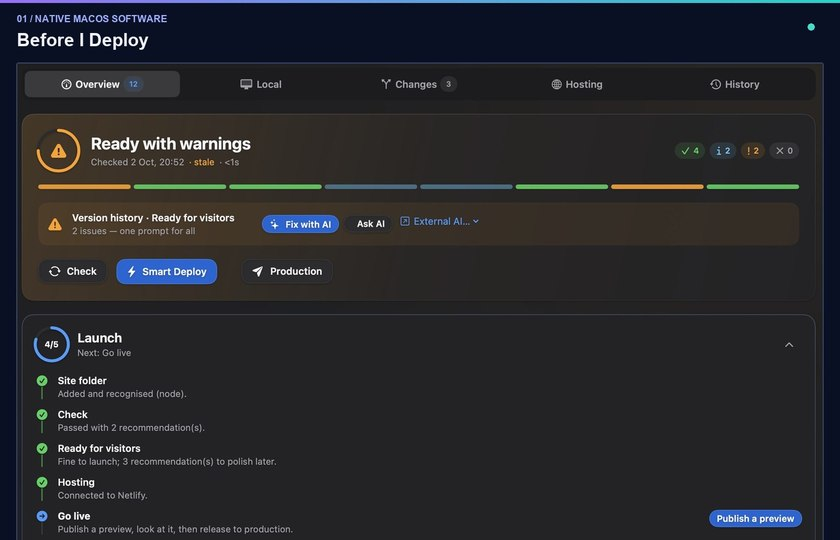
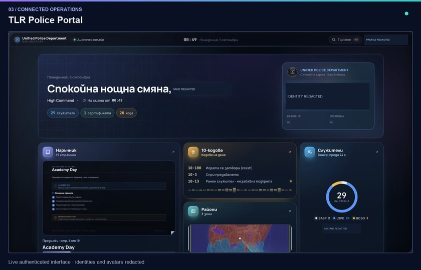
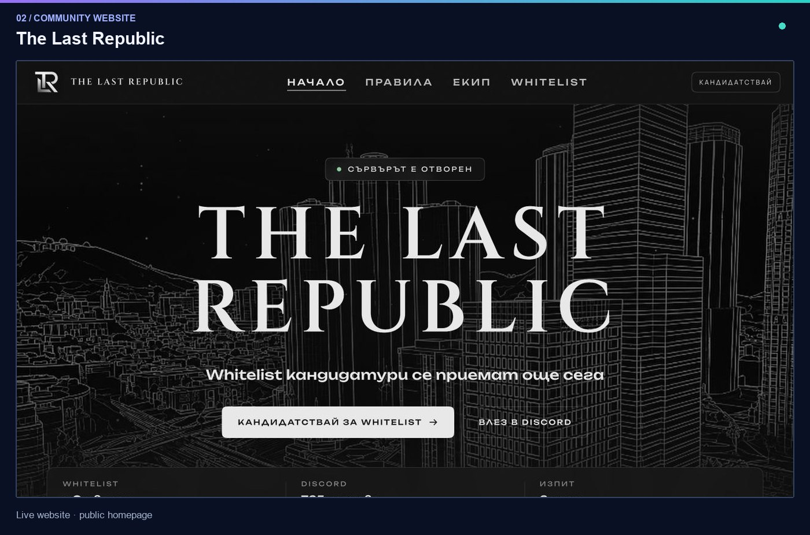
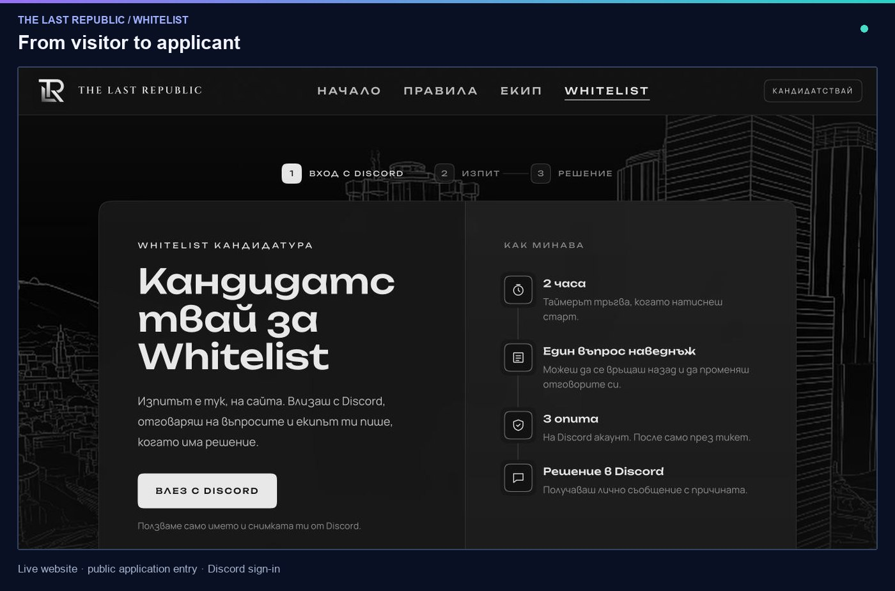

### Yavor Yakow · Product-minded developer

I build the interface, the logic behind it, and the connections that make it useful. 
My work includes native developer tools, community websites and operational software.

**Available for paid projects** · Based in Bulgaria

[Selected work](#selected-work) · [Services](#services) · [Technology](#technology) · [Contact](#contact)

## Selected work

**[01 — Before I Deploy](#before-i-deploy)** · Native macOS tooling 
**[02 — The Last Republic](#the-last-republic)** · Community website & application journey 
**[03 — TLR Police Portal](#tlr-police-portal)** · Staff operations & Discord integration

Actual application and website captures. Private identities are cropped or visibly redacted. Click any full-size image to inspect it.

## Before I Deploy

**Make release preparation understandable, from the first check to the next action.**

A native macOS application for reviewing local web projects, understanding warnings and preparing a preview or production release. I developed the SwiftUI interface, the Node.js command engine and the connections between project checks, hosting and cloud services.

**What is behind the screen**

- **One check pipeline:** Git state, secrets, dependencies, lint, types, build and hosting readiness, with results returned to the app as NDJSON events.
- **Release safeguards:** the engine checks for changed project fingerprints and requires explicit confirmation before production deployment.
- **A useful control centre:** project status, site monitoring, SSL information and a command palette for moving between tasks.
- **AI-assisted repair:** an implemented review-and-apply workflow for proposed file changes. Provider setup and service availability determine what can run.

**Built with:** Swift · SwiftUI · JavaScript · Node.js · Supabase · PostgreSQL · Deno Edge Functions

<b>Explore the application — Mission Control & keyboard navigation</b>

### Mission Control

### Command palette

Actively developed product. Screens show the installed application with a demo project; they do not imply a public release or that every external integration has been validated. Source is private.

[Discuss the product or a similar tool →](mailto:Fraisbg1@gmail.com?subject=Before%20I%20Deploy)

## The Last Republic

**A community website with a clear route from discovery to application.**

I developed the public web experience, rules pages and Discord-connected whitelist journey for a FiveM roleplay community. The interface brings the community identity, onboarding information and application entry into one site.

**Built with:** TypeScript · Next.js · React · Tailwind CSS · Netlify 
**Implemented connections:** Discord sign-in and an application workflow with staff review.

[Visit the website →](https://the-last-republic.netlify.app/) · [View the application entry →](https://the-last-republic.netlify.app/whitelist)

<b>See the public whitelist entry screen</b>

## TLR Police Portal

**Turn a community's staff structure into a usable operations workspace.**

An internal portal for the TLR roleplay police department. I developed the dashboard, searchable staff directory, rank hierarchy, handbook and management workflows for certificates, strikes and callsigns, with server-side access checks and audit records.

**The engineering decision:** Discord membership events need a persistent connection. A separate Node.js bot handles the Gateway connection and synchronizes Discord-owned roster fields into Postgres. The Next.js website handles authorized management actions. Both use a shared role map.

**Built with:** TypeScript · Next.js · React · PostgreSQL / Neon · Drizzle ORM · Node.js · discord.js

### Inside the portal

<b>Open the gallery — rank hierarchy & interactive handbook</b>

### Rank hierarchy

### Interactive handbook

<b>Play the short handbook navigation demo (animated GIF)</b>

<picture>
  <source media="(prefers-reduced-motion: reduce)" srcset="assets/screens/police-handbook.jpg" />
  
</picture>

Three captured states from real page navigation, with pauses for readability. No interface or data has been fabricated.

[Open the portal →](https://the-last-republic.netlify.app/police) · Discord authentication and department membership required. Source is private.

## Services

**Custom development for businesses, creators and communities.**

- **Websites & online stores** — business websites, landing pages, storefronts, checkout and third-party integrations.
- **Web & desktop software** — applications, dashboards, administrative panels, customer portals and internal tools.
- **Discord, games & FiveM** — bots, community workflows, gameplay systems, server tools and connected interfaces.
- **APIs, automation & AI** — service integrations, webhooks, scripts, AI-assisted features and workflow automation.
- **Maintenance & continued development** — new features, bug fixes, interface improvements and release preparation.

These are available service areas. The case studies above show specific implemented work; the scope, technologies and deliverables for a new project are agreed individually.

## Technology

**Native & developer tooling:** Swift / SwiftUI for the macOS app; JavaScript / Node.js for the engine; NDJSON for structured communication.

**Web & operations:** TypeScript / React / Next.js for TLR; Tailwind CSS for styling; PostgreSQL / Neon and Drizzle for the portal's data layer; discord.js for the persistent bot.

**Cloud services:** Supabase / PostgreSQL and Deno Edge Functions in Before I Deploy; Netlify for the public TLR website.

**Exploration:** additional game engines, cross-platform desktop approaches and new AI-assisted workflows. I distinguish experiments from the implemented work shown here.

## How I work

1. **Define the problem.** Identify the users, the workflow and what a useful first release needs to do.
2. **Design the whole path.** Connect the interface, data model, permissions and integrations.
3. **Build in reviewable steps.** Deliver working features and make decisions visible.
4. **Validate the release.** Check behaviour, failure states and deployment requirements.
5. **Keep improving.** Document the handoff, maintain the product and plan the next iteration.

## Contact

**Tell me the problem, the main features, your timeline and your budget range.**

- **Email:** [Fraisbg1@gmail.com](mailto:Fraisbg1@gmail.com)
- **Phone:** +359 898 634 678
- **Discord:** Fraisbg
- **Instagram:** [@y.yakowvw.sales](https://www.instagram.com/y.yakowvw.sales/)

Visual assets live in this repository. SVG motion respects reduced-motion preferences where supported. [About the screenshots](assets/README.md).
