

<picture>
<source media="(max-width: 600px)" srcset="assets/motion/hero-en-mobile.svg" />

</picture>

<b><a href="#work">Work</a> · <a href="#services">Services</a> · <a href="#technology">Technology</a> · <a href="#activity">Activity</a> · <a href="#process">Process</a> · <a href="#contact">Contact</a></b>

## 👋 Hi, I'm Yavor

I build digital products that connect design, code and real-world workflows. My work spans web development, custom software, Discord bots, games, FiveM systems, automation and developer tools.

**I take on paid development projects** — from a focused feature or a new website to a complete custom platform. I can help turn an early idea into a clear scope, build the product, connect its systems and prepare it for launch.

<picture>
<source media="(max-width: 600px)" srcset="assets/motion/divider-01-en-mobile.svg" />

</picture>

## 🚀 Selected Work

<table>
<tr>
<td width="50%" valign="top">

### 🟣 [Before I Deploy](#before-i-deploy)
**Know before you ship.** A native macOS app that checks web projects before production: environments, dependencies, linting, types, tests, builds, security and configuration.

**Developer tools · Automation · Release readiness**

</td>
<td width="50%" valign="top">

### 🔵 [TLR Police Portal](#tlr-police-portal)
Internal management for employee profiles, departments, ranks, callsigns, certificates and strikes, with permissions and audit logs.

**Management software · Role-based access · Integrations**

</td>
</tr>
<tr>
<td width="50%" valign="top">

### 🩷 [The Last Republic](#the-last-republic)
Connected gaming and community infrastructure bringing together FiveM, web applications, Discord, databases, staff tools and permissions.

**Full-stack systems · Gaming · Community infrastructure**

</td>
<td width="50%" valign="top">

### 🟠 Client Web Projects
**„Помощ от приятел“** (educational centre) and **„Автоинструктор Господинов“** (driving instructor). [See the client projects below](#client-websites).

**Business websites · UI/UX · Custom functionality**

</td>
</tr>
</table>

Much of my project source code is private. This profile presents the work, the capabilities and the approach behind it.

<picture>
<source media="(max-width: 600px)" srcset="assets/motion/project-bid-en-mobile.svg" />

</picture>

## Before I Deploy

**Make release preparation understandable, from the first check to the next action.**

A native macOS application for reviewing local web projects, understanding warnings and preparing a preview or production release. **My contribution:** I developed the SwiftUI interface, the Node.js command engine and the connections between project checks, hosting and cloud services.

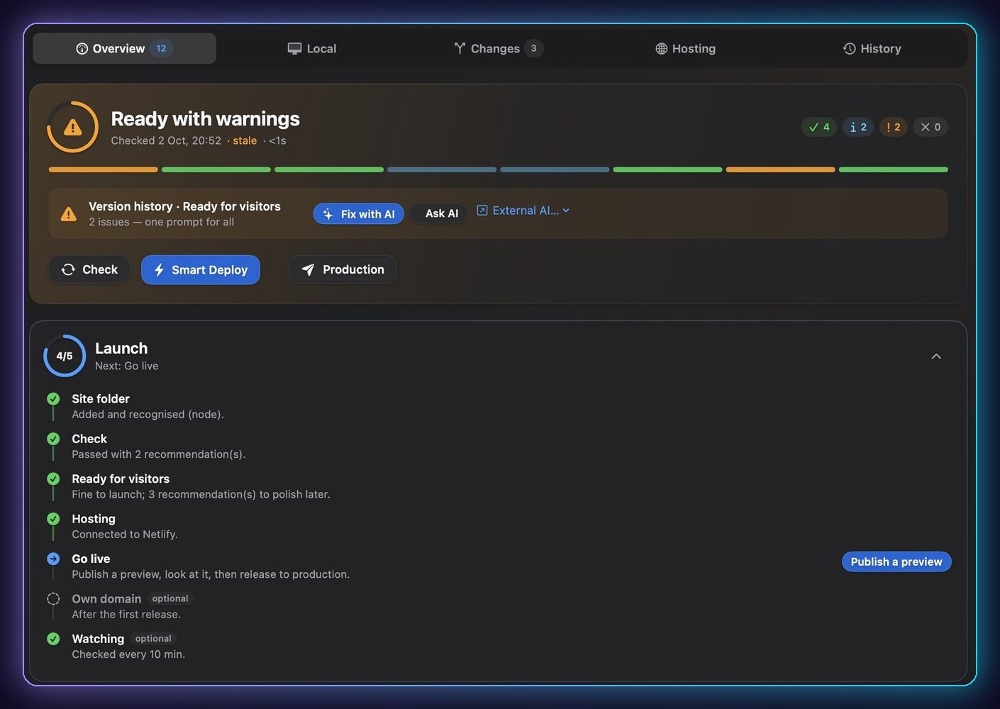

- **One check pipeline:** Git state, secrets, dependencies, lint, types, build and hosting readiness, with results returned to the app as NDJSON events.
- **Release safeguards:** the engine checks for changed project fingerprints and requires explicit confirmation before production deployment.
- **A useful control centre:** project status, site monitoring, SSL information and a command palette for moving between tasks.
- **AI-assisted repair:** an implemented review-and-apply workflow for proposed file changes. Provider setup and service availability determine what can run.

<picture>
<source media="(max-width: 600px)" srcset="assets/motion/arch-bid-en-mobile.svg" />

</picture>

**Built with:** Swift · SwiftUI · JavaScript · Node.js · Supabase · PostgreSQL · Deno Edge Functions

<b>Explore the application — Mission Control & keyboard navigation</b>

### Mission Control

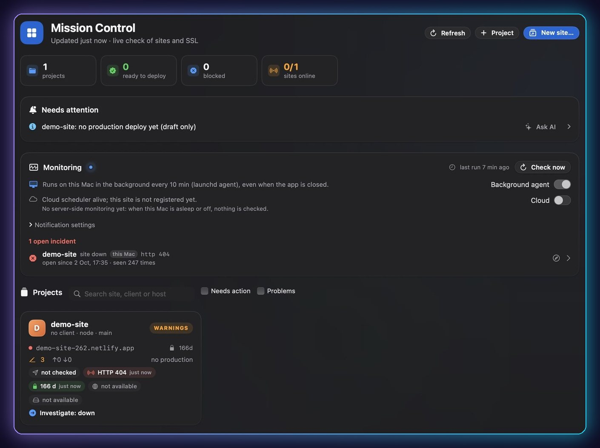

### Command palette

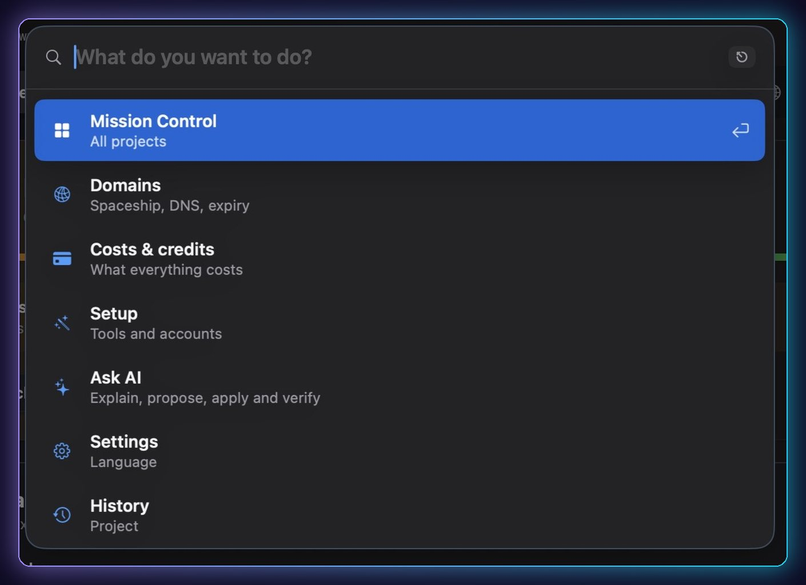

Actively developed product. Screens show the installed application with a demo project; they do not imply a public release or that every external integration has been validated. Source is private.

[Discuss the product or a similar tool →](mailto:Fraisbg1@gmail.com?subject=Before%20I%20Deploy)

<picture>
<source media="(max-width: 600px)" srcset="assets/motion/project-police-en-mobile.svg" />

</picture>

## TLR Police Portal

**Turn a community's staff structure into a usable operations workspace.**

An internal portal for the TLR roleplay police department. **My contribution:** I developed the dashboard, searchable staff directory, rank hierarchy, handbook and management workflows for certificates, strikes and callsigns, with server-side access checks and audit records.

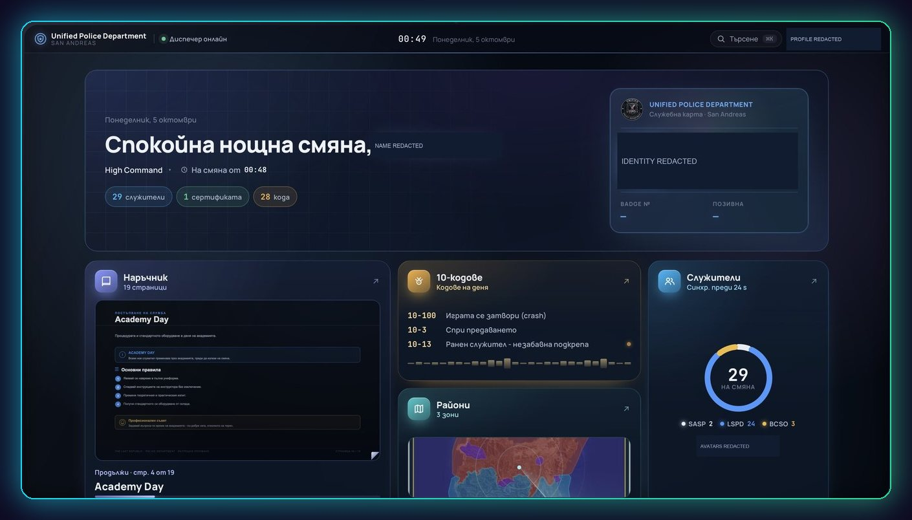

**The engineering decision:** Discord membership events need a persistent connection. A separate Node.js bot handles the Gateway connection and synchronizes Discord-owned roster fields into Postgres. The Next.js website handles authorized management actions. Both use a shared role map.

<picture>
<source media="(max-width: 600px)" srcset="assets/motion/arch-tlr-en-mobile.svg" />

</picture>

**Built with:** TypeScript · Next.js · React · PostgreSQL / Neon · Drizzle ORM · Node.js · discord.js

### Inside the portal

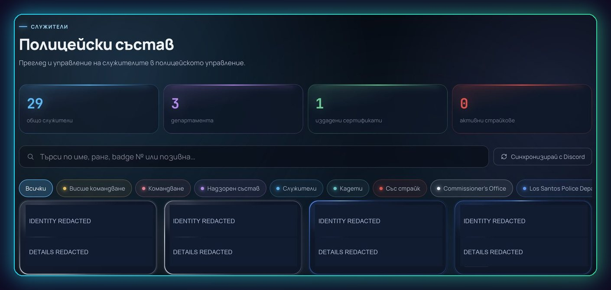

<b>Open the gallery — rank hierarchy & interactive handbook</b>

### Rank hierarchy

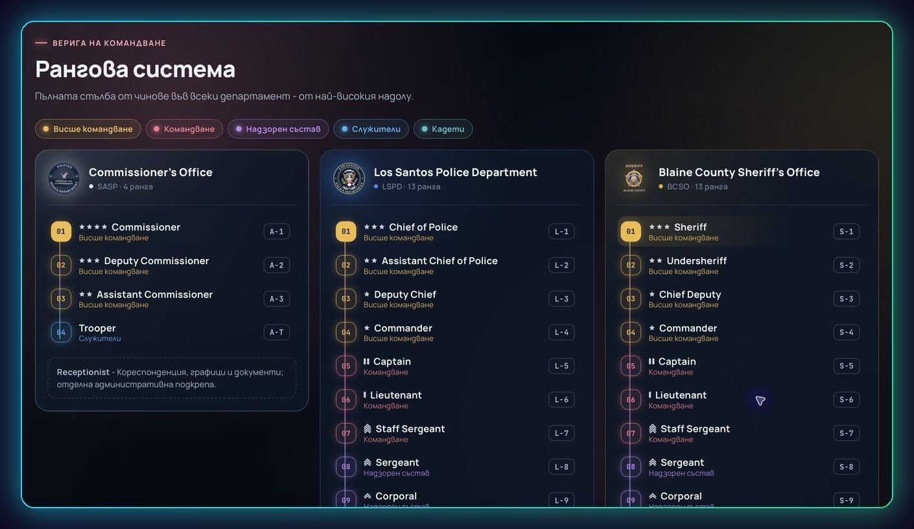

### Interactive handbook

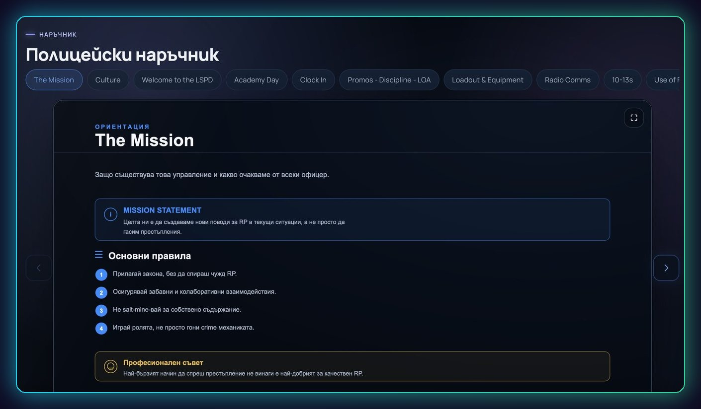

<b>Play the short handbook navigation demo (animated GIF)</b>

<picture>
  <source media="(prefers-reduced-motion: reduce)" srcset="assets/screens/police-handbook.jpg" />
  
</picture>

Three captured states from real page navigation, with pauses for readability. No interface or data has been fabricated.

Portal captures from the earlier review. Discord authentication and department membership required. Current entry URL is being confirmed; source is private.

<picture>
<source media="(max-width: 600px)" srcset="assets/motion/project-tlr-en-mobile.svg" />

</picture>

## The Last Republic

**Community infrastructure connecting the website, Discord and operational tools.**

**My contribution:** the public interface, rules and Discord-connected application journeys for the FiveM community.

The current main-site URL and version are being confirmed. Earlier homepage captures are not presented as the current website.

<picture>
<source media="(max-width: 600px)" srcset="assets/motion/project-community-en-mobile.svg" />

</picture>

## Community platform

**A shared entry point for a gaming community, its rules and player journeys.**

A separate React implementation whose interface is branded TLR RP and focuses on Minecraft SMP and Factions. The frontend brings server discovery, topic-based rules and application routes into one consistent navigation system. This is a local source-code showcase, not the current main website of The Last Republic.

<b>View the local interface from the reviewed source</b>

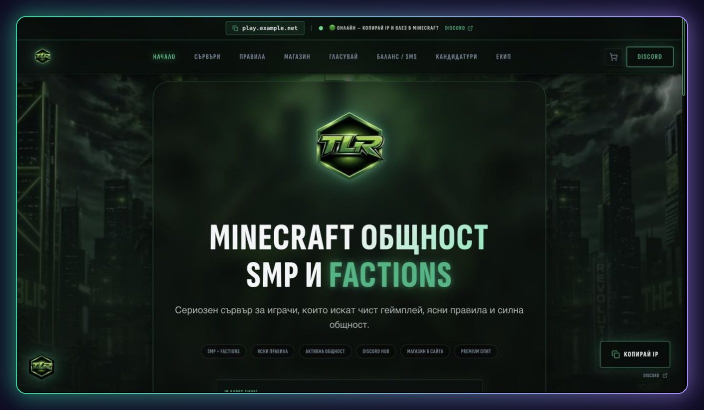

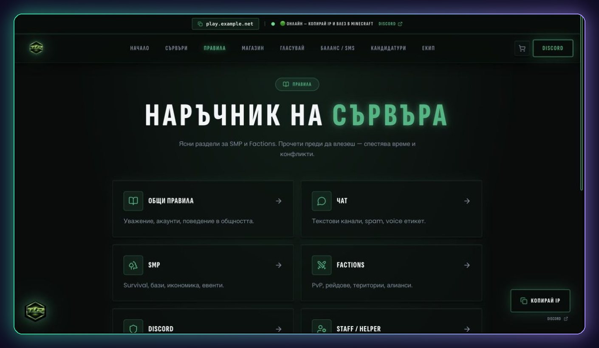

**Technical detail:** React Router handles the page journeys, route components load on demand, and React Query manages remote data caching. The repository also contains Supabase-backed authentication, data access and server functions.

**Built with:** TypeScript · React · Vite · Tailwind CSS · shadcn/ui · React Router · TanStack Query · Supabase

Captured from the unmodified frontend running locally, with production services disconnected. Placeholder addresses and status text are repository defaults. These images demonstrate the interface, not a verified live server, checkout or authentication deployment. Source code is private.

### Code experiment — Space Control

A browser-based interface experiment exploring simulated resource monitoring and control feedback. The reviewed source includes HTML screens and Canvas elements, with references to JavaScript files for the intended interactions.

**Technology:** HTML · JavaScript · Canvas API

Source preview only: the reviewed checkout is missing referenced styling and script assets. A complete visual demo is pending those assets or a working demo URL. Source code is private.

<picture>
<source media="(max-width: 600px)" srcset="assets/motion/project-client-en-mobile.svg" />

</picture>

## Client websites

### Помощ от приятел · Educational centre

A client website that helps parents explore Bulgarian-language and mathematics lessons and reach the centre through a clear enquiry path. The live interface includes course formats, an FAQ and an enquiry form.

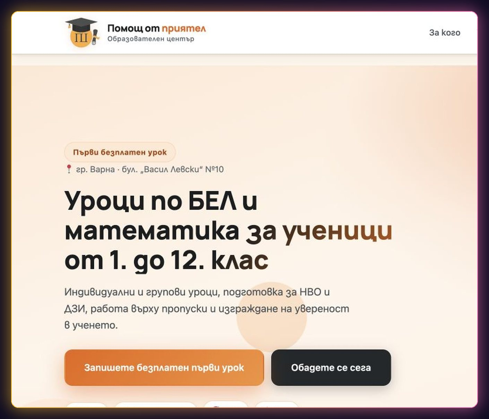

**Verified platform components:** WordPress · WPForms. The enquiry interface was inspected without submitting personal data.

<b>Explore the interactive FAQ</b>

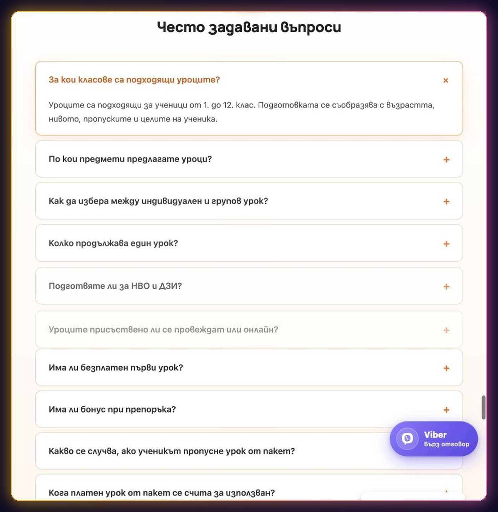

[Visit Помощ от приятел →](https://pomoshtotpriyatel.com/)

### Автоинструктор Господинов · Driving instructor

Client website for a driving instructor, providing an online presence for the business.

Website link, current screenshots, implementation details and technology are awaiting verification.

<picture>
<source media="(max-width: 600px)" srcset="assets/motion/divider-02-en-mobile.svg" />

</picture>

## 💼 What You Can Hire Me For

<table>
<tr>
<td width="50%" valign="top">

### 🌐 Websites & Online Businesses
Business websites, landing pages, portfolios, online stores, booking interfaces, content-driven sites and complete website redesigns.

**Responsive design · UI/UX · Integrations · Performance**

</td>
<td width="50%" valign="top">

### ⚙️ Custom Software & Platforms
Web applications, desktop utilities, dashboards, admin panels, customer portals, internal tools and business management systems.

**Frontend · Backend · Databases · Authentication**

</td>
</tr>
<tr>
<td width="50%" valign="top">

### 💬 Discord Bots & Communities
Custom bots, slash commands, ticket systems, moderation, roles, notifications, logging, community workflows and connected dashboards.

**Bot development · APIs · Automation · Server integrations**

</td>
<td width="50%" valign="top">

### 🎮 Games & FiveM Systems
Custom games and prototypes, gameplay systems, server resources, NUI interfaces, jobs, inventories, staff tools and community infrastructure.

**Game logic · Client/server systems · Persistence · Tooling**

</td>
</tr>
<tr>
<td width="50%" valign="top">

### 🤖 Automation & AI Integrations
Workflow automation, repetitive-task scripts, AI-powered features, assistant integrations, data-processing utilities and connected services.

**APIs · Webhooks · Scripting · AI-assisted workflows**

</td>
<td width="50%" valign="top">

### 🛠️ Improvements & Ongoing Development
New features, bug fixes, refactoring, performance improvements, migrations, interface refreshes, testing and deployment preparation.

**Existing projects · Technical cleanup · Maintenance**

</td>
</tr>
</table>

**Offered · proven · exploring.** The cards above are services I offer. The projects above show the experience already implemented. The technology panels below separate tools used in those products from wider interests.

<b>Explore the full development service catalogue</b>

| Development area | Project types and scope |
| :--- | :--- |
| 🌍 **Websites** | Company sites, personal brands, portfolios, landing pages, campaign pages, directories and content sites |
| 🛒 **E-commerce** | Product catalogues, storefronts, checkout integrations, customer accounts and order-management tools |
| 📅 **Booking & Scheduling** | Appointment flows, availability interfaces, reservation systems, reminders and calendar integrations |
| 🧩 **Web Applications** | SaaS interfaces, membership platforms, customer portals, collaboration tools and interactive dashboards |
| 🖥️ **Desktop Software** | Custom utilities, launchers, productivity tools, installers and desktop interfaces |
| 📱 **Mobile Experiences** | Responsive mobile interfaces, progressive web apps and mobile-focused prototypes |
| 🎨 **Frontend & UI/UX** | Interface design and implementation, component libraries, design systems, animation and accessibility improvements |
| ⚙️ **Backend Systems** | Application logic, API services, background tasks, validation and integrations |
| 🗄️ **Databases** | Schema design, migrations, import/export tools, persistence, reporting and query optimization |
| 🔐 **Accounts & Permissions** | Sign-in flows, user profiles, role-based access, staff permissions and audit trails |
| 🔌 **APIs & Integrations** | Third-party services, webhooks, payment-provider integrations, notifications and connected workflows |
| 💬 **Discord Development** | Bots, commands, moderation, tickets, role systems, logs, dashboards and game-server connections |
| 🎮 **Games & Interactive Projects** | Game prototypes, gameplay features, browser games, interfaces and supporting tools |
| 🚓 **FiveM Development** | Custom resources, NUI, jobs, police/government systems, administration and database-connected features |
| 🏢 **Business Software** | CRM-style tools, employee management, inventory workflows, operations panels and custom internal systems |
| 🤖 **AI Features** | AI API integrations, assistants, content workflows and AI-supported product features |
| 🔁 **Automation & Scripting** | Task automation, file processing, data transformation, notifications and service orchestration |
| 🧰 **Developer Tools** | CLI tools, project validators, release utilities, debugging tools and workflow helpers |
| 🧪 **Testing & Quality** | Test setup, regression checks, linting, type checking, build validation and bug investigation |
| 🚀 **Deployment & Maintenance** | Environment setup, CI/CD workflows, release preparation, monitoring integrations and ongoing improvements |

**Every project is scoped individually.** Features, platform support, integrations, delivery time and pricing depend on the requirements we agree on.

> **Have something different in mind?** I also consider custom development outside this list. Start with the problem, the users and what a successful result should do.

<picture>
<source media="(max-width: 600px)" srcset="assets/motion/divider-03-en-mobile.svg" />

</picture>

## 🌈 Languages & Technology

<picture>
<source media="(max-width: 600px)" srcset="assets/motion/stack-used-en-mobile.svg" />

</picture>

The 68 technologies below are the original technology collection: additional interests and possible project choices. It is not a claim of completed products or equal experience with every tool. A **mint ring** marks the tools verified in the products above.

<picture>
<source media="(max-width: 600px)" srcset="assets/motion/stack-tools-en-mobile.svg" />

</picture>

<picture>
<source media="(max-width: 600px)" srcset="assets/motion/stack-languages-en-mobile.svg" />

</picture>

<picture>
<source media="(max-width: 600px)" srcset="assets/motion/stack-web-en-mobile.svg" />

</picture>

<picture>
<source media="(max-width: 600px)" srcset="assets/motion/stack-data-en-mobile.svg" />

</picture>

<picture>
<source media="(max-width: 600px)" srcset="assets/motion/stack-games-en-mobile.svg" />

</picture>

The right stack depends on the product; the panels do not imply equal specialization in every language. Specific tools and implementation scope are agreed for each engagement. Logos: original brand colours via <a href="https://simpleicons.org">Simple Icons</a> (CC0); SQL, C#, PowerShell, Objective-C and OpenAI appear as text tiles, as in the original badges.

<picture>
<source media="(max-width: 600px)" srcset="assets/motion/divider-04-en-mobile.svg" />

</picture>

## 📊 Activity & language mix

<picture>
<source media="(max-width: 600px)" srcset="assets/metrics/activity-en-mobile.svg" />

</picture>

<picture>
<source media="(max-width: 600px)" srcset="assets/metrics/languages-en-mobile.svg" />

</picture>

<b>How these numbers are calculated</b>

Activity refreshes daily from the public GitHub contribution calendar. Contributions are not just commits and do not measure hours worked. “Last contribution” is the last active calendar day, not the last login. GitHub may update the calendar with a delay.

The current streak counts consecutive active days ending today, or yesterday when today has no contribution yet. Longest streak, contribution totals and active days refer to the displayed annual window. The mobile heatmap shows the last 26 weeks; headline totals still use the annual window.

Language shares are a separate 2026-10-05 snapshot of GitHub-reported code bytes, including private projects and excluding this profile repository. They do not measure frequency, time or proficiency. The language snapshot is not refreshed automatically: the public workflow has no access to private code.

[GitHub contribution rules](https://docs.github.com/en/account-and-profile/reference/profile-contributions-reference) · [Metrics source](scripts/update_metrics.py)

## 🧭 From Your Idea to a Working Product

<picture>
<source media="(max-width: 600px)" srcset="assets/motion/process-en-mobile.svg" />

</picture>

### What Matters in My Work

**🎯 Purposeful design** — interfaces and features built around the people using them. 
**🧱 Clear architecture** — understandable code and systems that can evolve. 
**🔐 Thoughtful permissions** — validation, access control and sensible defaults. 
**🧪 Practical quality checks** — testing, diagnostics and validation before release. 
**🔁 Useful automation** — fewer repetitive steps and more consistent workflows. 
**🤝 Clear project scope** — agreed requirements, deliverables and expectations.

<picture>
<source media="(max-width: 600px)" srcset="assets/motion/divider-05-en-mobile.svg" />

</picture>

## 📬 Let's Talk About Your Project

<picture>
<source media="(max-width: 600px)" srcset="assets/motion/finale-en-mobile.svg" />

</picture>

<b>Available for paid websites, custom software, Discord bots, games and development work.</b> 
Send me your idea, the main features, your preferred timeline and your budget range. We can define the right scope and a custom quote.

<picture>
<source media="(max-width: 600px)" srcset="assets/motion/footer-en-mobile.svg" />

</picture>

Real captures and locally stored visuals; decorative motion never represents live activity, and all animation pauses for reduced-motion settings. [Screenshot provenance and accessibility notes](assets/README.md).

Project source code is private; this profile presents selected real interfaces.
